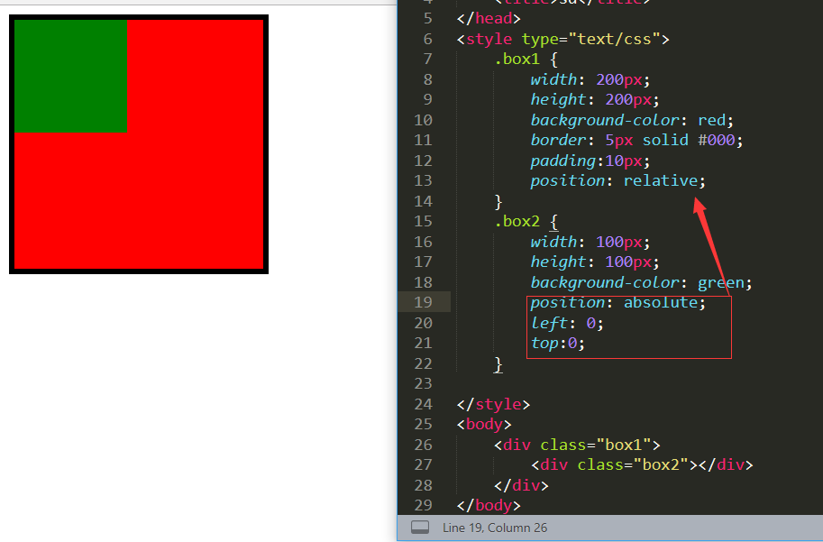

# 关于元素定位的核心概念
### 构建块

CSS采用盒子模型来处理每一个HTML元素，盒子可以是一个“块级”盒子，也可以是一个“内联”盒子

### 包含元素

如果一个块级元素位于另一个块级内部，那么这个外部的框就成为父元素

### 控制元素的位置

**CSS中包含三种用于控制页面布局的定位机制：普通流|相对定位|绝对定位。**

- 普通流
- 相对定位
-  绝对定位(脱离标准流)
- 固定定位(脱离标准流)
- 浮动元素(脱离标准流)
- 
**任何元素从普通流脱离时，盒子会产生重叠。可以使用z-index属性来控制将哪个盒子显示在上层**

# 定位流
### 相对定位
- position:relative;
- 相对定位是相对于自己以前在标准流中的位置来移动
- 相对定位是不脱离标准流的，会在标准流中占一份空间
- 同一个方向上的定位属性只能使用一个
- 相对定位区分块级元素/行内元素/行内块级元素
- 相对定位设置margin/padding属性是根据未定位之前的位置移动的

### 绝对定位
- position:absolute;
- 绝对定位不区分块级元素/行内元素/行内块级元素，可以设置宽 高
- 规律
  - 默认情况下所有绝对定位的元素，无论有没有祖先元素都会以body作为参考点
  - 绝对定位的元素祖先元素也是定位流，那么这个绝对定位的元素就会以那个祖先元素作为参考点
  - 定位流指 绝对定位/相对定位/固定定位(唯有静态定位不行)
  - 绝对定位的祖先元素也是定位流， 而且祖先元素中有多个元素都是定位流，那么这个绝对定位的元素会以离它最近的那个定位流祖先元素为参考点
- **注意**
  - 绝对定位的元素若以body为参考点，其实是以**网页首屏**的宽度和高度作为参考点，而不是以整个网页的宽度和高度作为参考点

  - 一个绝对定位的元素会忽略祖先元素的padding属性

### 固定定位
- 固定定位与背景关联方式很像
  - 背景定位(background-attachment:fixed)可以让背景图片不随着滚动条的滚动而滚动
  - 固定定位(position:fixed)可以让某个盒子不随着滚动条的滚动而滚动
  - **注意点**
    - 固定定位的元素脱离标准流，不占用标准流的空间
    - 固定定位和绝对定位一样不区分行内/块级/行内块元素
### 补充一哈
- Z-index 属性
  
  - z-index属性的作用是专门用于控制定位流元素的覆盖关系的
- 默认情况定位流的元素会覆盖标准流的元素
- 定位流的元素会盖住前面的定位流

  - **注意点**
  1. 如果两个元素的父元素都没有设置z-index属性 ,那么谁的z-index属性大 谁就显示在上面
  2. 如果两个元素的父元素设置了z-index属性，子元素的z-index属性就失效

