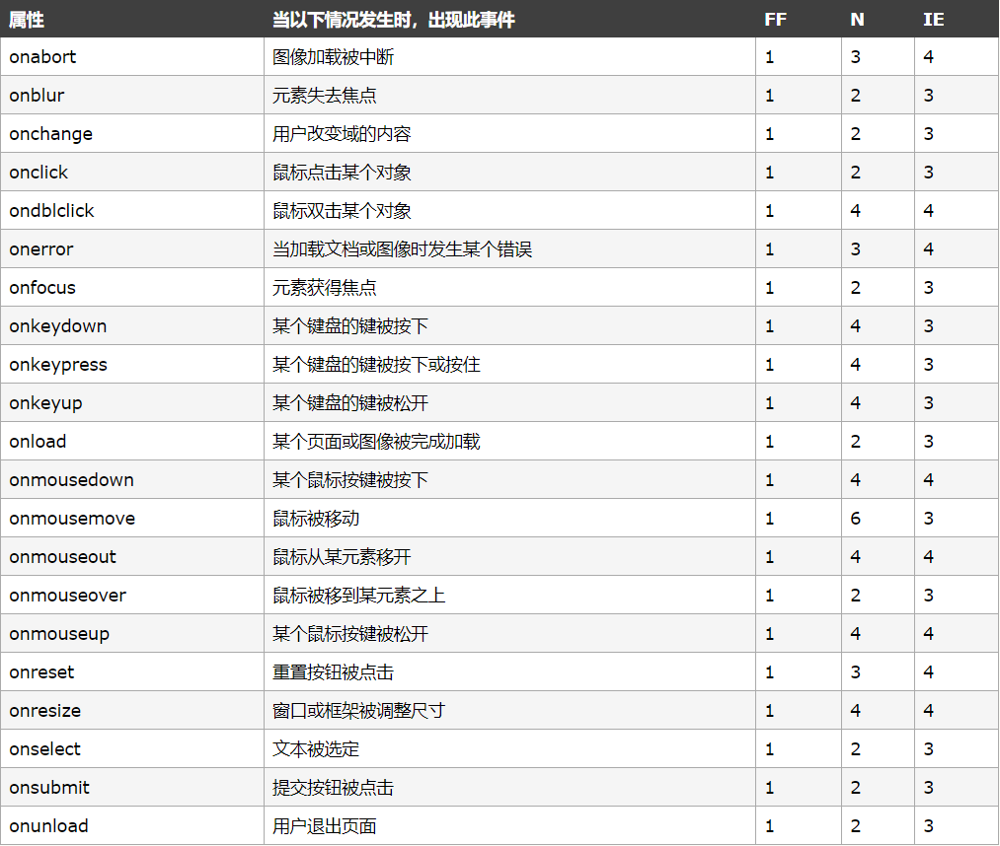

# 事件

**步骤**

- 获取事件源
- 绑定事件
- 书写事件驱动程序

**常见的事件**



### 获取事件源

- document.getElementById(); //根据id选择器

- document.getElementsByClassName()[0]; //根据类选择器

- document.getElementsByTagName()[0]; //根据标签去拿

- document.getElementsByName(); //根据name属性

- document.querySelector("#btn"); //只会取到第一个

- document.querySelectorAll(".btn");  //匹配所有


1. 鼠标进入
  - `onmouseover`
2. 鼠标移出
  - `onmouseout`
3. 鼠标移动
  - `onmousemove`
4. 鼠标点下
  - `onmouseup`
  - `onmousedown`

```javascript
<div id="box"></div>

<script>

  var box = document.getElementById("box");
  //鼠标进入
  box.onmouseover = function() {
    console.log("鼠标进入");
  };
  //鼠标移出
  box.onmouseout = function() {
    console.log("鼠标移出");
  }
  // 鼠标移动
  box.onmousemove = function() {
    console.log("鼠标移动");
  }
  // 鼠标点下
  box.onmousedown = function() {
    alert("你按下了鼠标");
  }
  box.onmouseup = function() {
    alert("你松开了鼠标");
  }
</script>
```


### 事件绑定

1. 匿名函数绑定
```
事件源事件 = function(){事件驱动程序}
```

2. 函数名绑定
```
div.onclick = deal;
function deal() {
  alert("收到");
}
```


