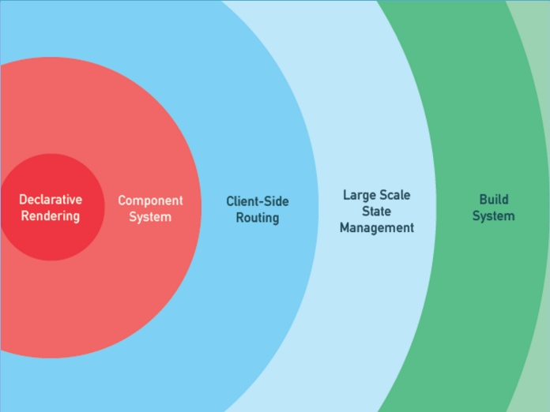
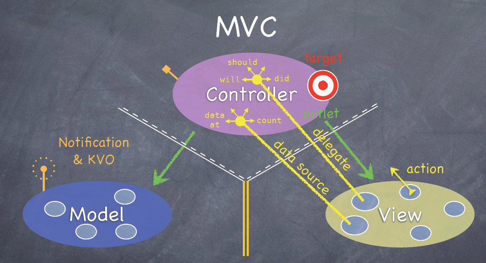

# Vue

Vue (读音 /vjuː/，类似于 view) 是一套用于构建用户界面的渐进式框架

> 渐进式 Progressive

主张最少。根据开发者的需求不断渐进。

Vue的核心库只关注视图层。

## MVC 与 MVVM

> MVC

MVC的思想：一句话描述就是Controller负责将Model的数据用View显示出来。

Model（模型）：是应用程序中用于处理应用程序数据逻辑的部分

View（视图）：是应用程序中处理数据显示的部分

Controller（控制器）：是应用程序中处理用户交互的部分

> MVVM

我们需要数据所以有了M，我们需要界面所以有了V，而我们需要找一个地方把M赋值给V来显示，所以有了C，然而我们忽略了一个很重要的操作：数据解析。于是为数据解析创建出了一个新的类：ViewModel

VM的出现使Controller存在感降低

**MVVM设计模式的优点**

1.  双向绑定技术，当Model变化时，View-Model会自动更新，View也会自动变化。很好的做到数据的一致性

2.  由于控制器的功能大都移动到View上处理，大大的对控制器进行了瘦身

3.  View的功能进一步强化，具有控制的部分功能，

**教程**

[中文文档](https://vuejs.bootcss.com/)