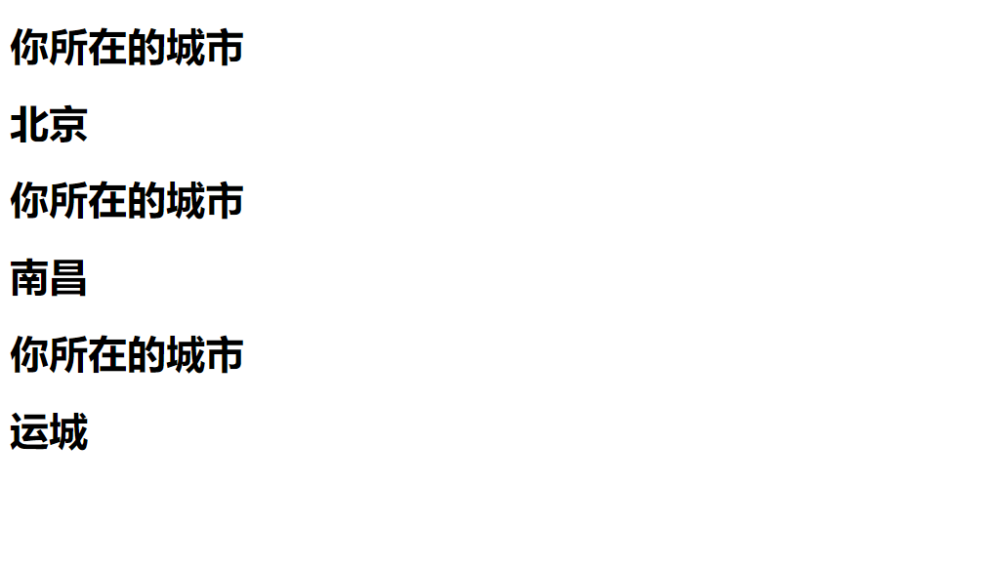
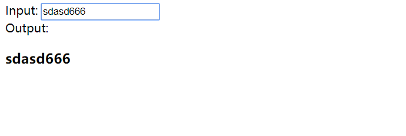

# 组件

## 组件的构成

三部分组成组件

1. prop
2. event
3. slot

## 组件的定义

> **全局组件**

`Vue.component`

```html
<div id="app">
    <tao></tao>
</div>

//创建构造器
let Alert = Vue.extend( {
		template:'<button @click="cle">点击</button>',
		methods:{
				cle:function () {
						alert("Hi");
				}
		}
});
//注册全局组件
Vue.component("tao",Alert);
```

> **局部组件**

```html
<div id="app">
    <show></show>
</div>


<script>
    var showH1 = Vue.extend({
        template:"<h1>Show!</h1>"
    });


    var app = new Vue({
        el: '#app',
        components:{
            "show":showH1
        }

    })
</script>
```

当然也可以这样写。

```js
var app = new Vue({
		el: '#app',
		components:{
				show:{
						template: "Hello<button @click='c'>Try!</button>",
						methods:{
								c:function () {
										alert("Click Me!");
								}
						}
				}
		}
})
```

> Vue组件中使用数据

```html
<div id="app">
    <show></show>
</div>

Vue.component('show',{
		template:"<div><button @click='c'>Click</button> <h1>{{num}}</h1></div>",
		data:function(){
				return{
						num:0
				}
		},
		methods:{
				c:function () {
						this.num+=1;
				}
		}

});
```

**注意**

可以看到再写组件的时候我在外面包了一层DIV标签，这是因为每个组件必须只有一个根元素。如果没有的话会显示一个错误`every component must have a single root element `

组件中使用data注意的是`data`必须是一个函数。因为每个实例维护一份返回对象，如果不是函数返回，那么其他相关组件都会跟着受影响。


##### 组件的复用

```html
<div id="app">
    <show></show>
    <show></show>
    <show></show>
</div>
```

点击按钮每个组件都会维护各自的数据。因为每用一个组件，就会有一个新实例被创建


> 组件之间的嵌套

子组件

```html
let son1 = Vue.extend({
		template:"<h1>Son1</h1>"
});

let son2 = Vue.extend({
		template:"<h1>Son2</h1>"
});
```

父组件

```js
//父
Vue.component("parent",{

		components:{
				"child1":son1,
				"child2":son2
		},
		template:"<div><child1></child1><child2></child2></div>",
});
```

最后只要渲染Parent标签就可以了

```html
<div id="app">
    <parent></parent>
</div>
```


> 自定义模板标签


```html
<div id="app">
    <my-div></my-div>
</div>

<template id="my-div">
    <div>
        <h1>Yo!</h1>
    </div>
</template>


Vue.component("my-div",{
		template:"#my-div"
});
```

这样就渲染了一个自己的模板只要指明他的ID

> **传递数据**

`Prop`

Prop可以在组件上注册一些自定义特性

#### 父子通信

在渲染一个组件的时候有时候需要向组件传递一些数据，并且展示


Demo

创建一个模板组件

```html
<template id="info">
    <div>
        <h1>你所在的城市</h1><h1>{{city}}</h1>
    </div>
</template>
```

注册
```js
Vue.component("info",{
		template:"#info",
		props:['city']
});
```

传递参数 在标签`<info city="Beijing"></info>` 写入属性city就把值传递过去了

```html
<div id="app">
    <info city="北京"></info>
    <info city="南昌"></info>
    <info city="运城"></info>
</div>
```





#### 子父通信

`$emit方法`


子组件需要与父组件进行沟通。沟通的方式为事件

Demo

```js
//子组件
Vue.component('show',{
		template: '<button @click="on_click">信息详情</button>',
		methods:{
				on_click:function () {
						/**
						 *  $emit()
						 *  参数1：
						 *      事件的名称
						 *  参数2：
						 *      传递的数据
						 * */
						this.$emit('show-info',{name:'Dandy', pets:['dog','cat']});
				}
		}
});

//父组件
Vue.component('info',{
		/**
		 *  show来监听事件
		 *  @show-info
		 * */
		template:'<div><show @show-info="show_mes"></show><div v-if="show">展示消息了</div></div>',
		data:function () {
				return{
						show:false
				}
		},
		methods: {
				/***
				 * 传递数据funtion后面添加参数data
				 */
				show_mes:function (data) {
						this.show = true;
						console.log('data',data)
				}
		}
});
```

```html
<div id="app">
    <info></info>
</div>
```

当点击按钮后子组件button会修改父组件的data属性 父组件相应显示数据。

同时也可以将子组件的数据传递给父组件上


#### 兄弟之间的通信

需要一个任务调度器

例子：输入与输出

```
//中心事件调度器
var Event = new Vue();
```

```js
//输入
Vue.component('in',{
		template: "<div>Input: <input  @keyup='change' type='text' v-model='msg'></div>",
		data:function(){
				return{
						msg:'',
				}
		},
		methods:{
				change:function () {
						Event.$emit('isSend',this.msg);
				}
		}
});
```

```js
//输出
Vue.component('out',{
		template: "<div>Output: <h3>{{rece}}</h3></div>",
		data:function () {
				return{
						rece:'',
				}
		},
		mounted:function(){
				var me = this;
				Event.$on('isSend',function (data) {
						console.log(data);
						me.rece = data; //变量来指代当前rece
				})
		}
});
```




