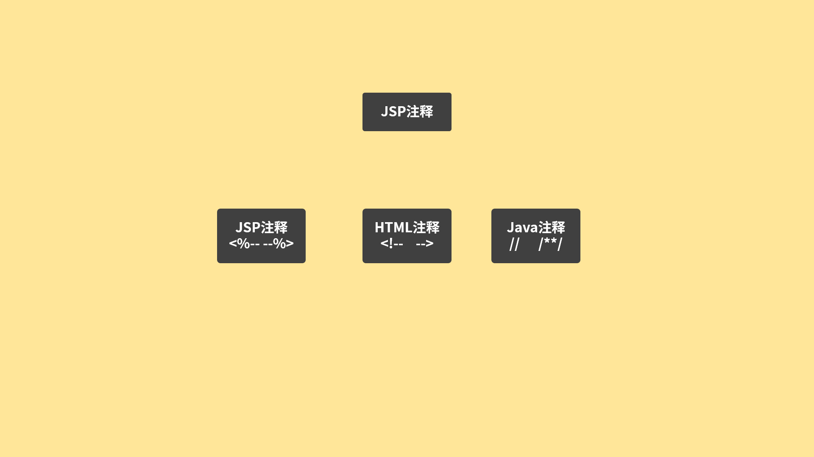

# JSP

---

Java Server Pages

> 是什么

JSP是一种动态网页开发技术。它使用JSP标签在HTML网页中插入Java代码，其根本是一个简化的servlet设计

> 为什么

JSP页面可以与处理业务逻辑的Servlet一起使用

一次编写，到处运行

>  工作原理

本质就是一个Servlet。服务器在管理JSP页面分为两个阶段 转换阶段和执行阶段。第一次访问会被Web容器(Tomcat) 翻译成Servlet， `index.jsp `->` index.jsp.java` -> `index.jsp.class`

下一次访问的时候就先看页面有没有变化，如果变化了就重新翻译

**基本模板**

```jsp
<%@ page contentType="text/html;charset=UTF-8" language="java" pageEncoding="UTF-8" %>

<html>
  <head>
    <title>JSP-Demo</title>
  </head>
  <body>

  </body>
</html>
```

## 语法

### 变量

通过JSP脚本可以将Java代码嵌入到HTML页面中。所有可执行Java代码，都可以通过JSP脚本来执行

**变量的三种表达方式**

- `<% Java_Code %> `代码会被翻译成service方法内部
- `<%= 变量或表达式 %> `代码会被service方法内部print()
- `<%! Java_Code %>` 代码会成为servlet成员变量

> <%=  %> JSP表达式

```
<%= new Date()%>
```

> <%  %> JSP脚本片段

注意：

- <%  %> 中可以定义变量、语句 不能定义方法
- 严格遵循Java语法；每个语句后都有一个分号结束
- 多个脚本片段可以互相访问

```
<%
    for(int i=0; i<5; i++) {
        out.print(i);
    }
%>
```

> <%!   %> JSP声明

JSP声明可用于定义JSP页面转换成的Servlet程序的静态代码块、成员变量和方法

### 注释



- `<!--  -->` html代码注释
- `//  /* */` 可见范围：jsp源码、翻译后的servlet源码。页面时看不到的
- `<%--   --%> `可见范围：仅在jsp源码可见

# JSP指令

设置页面的相关信息，用于与其他jsp文件的通信

**分类**

- page指令

- include指令

- taglib指令


### Page指令

<%@指令  属性名="值"%>

> page 指令设置页面的属性和相关信息

- contentType=”text/html;charset=UTF-8” 编码格式
- pageEncoding文件编码
- import引入Java的包和类
- session
- errorPage发生错误会跳转
- isErrorPage
- language
- extends
- buffer设置缓冲区
- autoFlush
- isThreadSafe
- info
- isELIgnored 是否支持EL表达式

```javadoc
<%@ page import="java.util.Date" %>
<%@ page contentType="text/html;charset=UTF-8" language="java" %>
```

**import 属性**

自动导入包

- java.lang.*
- javax.servlet.*
- javax.servlet.jsp.*
- javax.servlet.http.*

手动导包

```jsp
<%@ page import="java.util.*,java.io.*,java.sql.*"%>
```

**errorPage属性**

- 在web.xml文件中使用`<error-page>`元素为整个Web应用程序设置错误处理页面
- `<error-page>`元素有3个子元素
  - `<error-code>`
  - `<exception-type>`
  - `<location>`
- `<error-code>`子元素指定错误的状态码，例如：`<error-code>404</error-code>`
- `<exception-type`>子元素指定异常类的完全限定名，例如：`<exception-type>java.lang.ArithmeticException</exception-type>`
- `<location>`子元素指定以“/”开头的错误处理页面的路径，例如：`<location>/ErrorPage/404Error.jsp</location>`

### Include指令

**格式**

```html
<%@ include file="被包含文件的地址" %>
```

```jsp
<!--index.jsp-->
<body>

    <%@ include file="./component/header.jsp" %>
    <div id="app" class="container">
        <h1>Main</h1>
    </div>
    <%@ include file="./component/footer.jsp" %>

</body>
```

### Taglib 指令

tablib声明使用了那些标签库

- JSP标签库
- 第三方库
- 自定义标签库

**标签库**

- 页面包含

```jsp
// 静态包含
/*
    将两个jsp页面拼接在一起，然后翻译servlet
*/
<%@
    include file="/header.jsp"
%>
<%@
    include file="/footer.jsp"
%>

// 动态包含
/*
    各自翻译自己的页面 然后引入
*/
<jsp:include page='/header.jsp'></jsp:include>
```

- 请求转发

```jsp

页面重定向
<jsp:forward page="404.jsp"></jsp:forward>
```

# JSP动作元素

```html
<jsp:include>

<jsp:forward>

<jsp:param>

<jsp:plugin>

<jsp:useBean>

<jsp:setProperty>

<jsp:getProperty>
```


