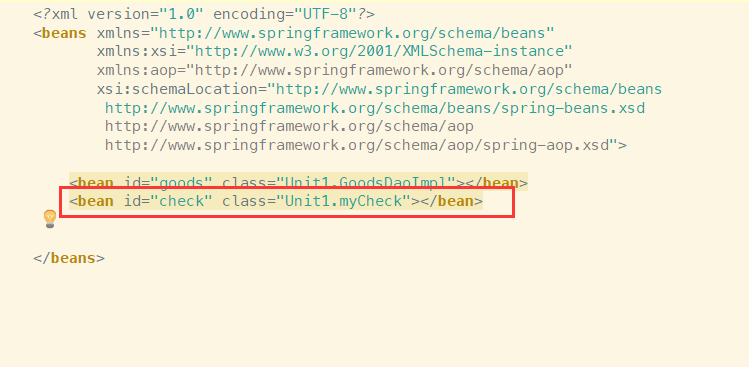
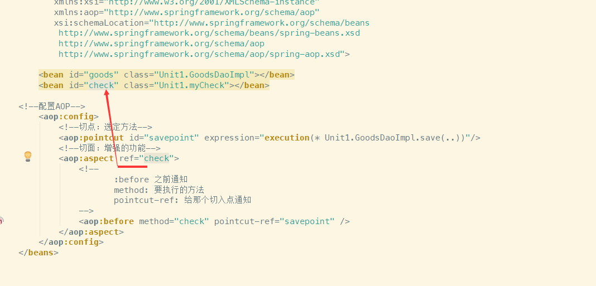

## AOP
**简介**

面向切面编程

通过预编译方式和运行期动态代理实现程序功能的统一维护的一种技术。

Aop采用横向抽取机制取代了传统纵向继承。

不破坏原来的类，生成一个代理类，在原来类的基础上增强可以随时添加，取消添加的功能。

是对传统OOP面向对象编程的扩展和延伸


**底层AOP实现原理（动态代理）**

- JDK动态代理

- cglib动态代理

## AOP相关术语

1. Joinpoint 连接点
2. Pointcut 切入点
3. Advice 通知
4. Introduction 引介
5. Target 被增加的对象
6. Weaving 织入
7. Proxy 代理对象
8. Aspect 切面

```java
public class GoodsDao{
    public void save(){};
    public void delete(){};
    public void update(){};
    public void find(){};
}
```

**连接点**可以是可以被拦截到的方法上面的`save()`、`delete()`...这几个方法都可以被增强称为连接点

**切入点**真正被拦截的方法

**通知**增加的内容，通常是封装成一个方法。

**引介**类层面的增强。给原有的类添加一些新的属性方法

**被增强的对象**即是GoodsDao

**织入**将通知应用到目标对象的过程


## AOP使用

**步骤**

1. 引入基本jar包
2. 引入aop开发jar包
3. 配置文件引入aop约束
4. 测试
5. 编写切面类
6. 切面交给Spring
7. 配置AOP完成代理

> 配置文件

```xml
<?xml version="1.0" encoding="UTF-8"?>
<beans xmlns="http://www.springframework.org/schema/beans"
       xmlns:xsi="http://www.w3.org/2001/XMLSchema-instance"
       xmlns:aop="http://www.springframework.org/schema/aop"
       xsi:schemaLocation="http://www.springframework.org/schema/beans
        http://www.springframework.org/schema/beans/spring-beans.xsd
        http://www.springframework.org/schema/aop
        http://www.springframework.org/schema/aop/spring-aop.xsd">


</beans>
```

> 切面交给Spring



> 配置AOP代理




```xml
<?xml version="1.0" encoding="UTF-8"?>
<beans xmlns="http://www.springframework.org/schema/beans"
       xmlns:xsi="http://www.w3.org/2001/XMLSchema-instance"
       xmlns:aop="http://www.springframework.org/schema/aop"
       xsi:schemaLocation="http://www.springframework.org/schema/beans
        http://www.springframework.org/schema/beans/spring-beans.xsd
        http://www.springframework.org/schema/aop
        http://www.springframework.org/schema/aop/spring-aop.xsd">

    <bean id="goods" class="Unit1.GoodsDaoImpl"></bean>
    <bean id="check" class="Unit1.myCheck"></bean>

<!--配置AOP-->
    <aop:config>
        <!--切点：选定方法-->
        <aop:pointcut id="savepoint" expression="execution(* Unit1.GoodsDaoImpl.save(..))"/>
        <!--切面：增强的功能-->
        <aop:aspect ref="check">
            <!--
                   :before 之前通知
                   method: 要执行的方法
                   pointcut-ref: 给那个切入点通知
            -->
            <aop:before method="check" pointcut-ref="savepoint" />
        </aop:aspect>
    </aop:config>
</beans>
```


## AOP通知类型

刚才的使用用了`<aop:before method="" pointcut-ref="">`

除了这个还有很多。

```html
1. 前置通知
<aop:before method="check" pointcut-ref="savepoint" />

2. 后置通知
它可以接收一个返回值 returning属性
<aop:after-returning method="log" pointcut-ref="savepoint" returning="与相应方法的参数相同"/>

3. 环绕通知
在目标执行之前与执行之后都进行操作
<aop:around method="log" pointcut-ref="savepoint"/>

4. 异常通知
当程序出现错误的时候就会通知
<aop:after-throwing method="" pointcut-ref=""/>

5. 最终通知
<aop:after method="" pointcut-ref=""/>
```


