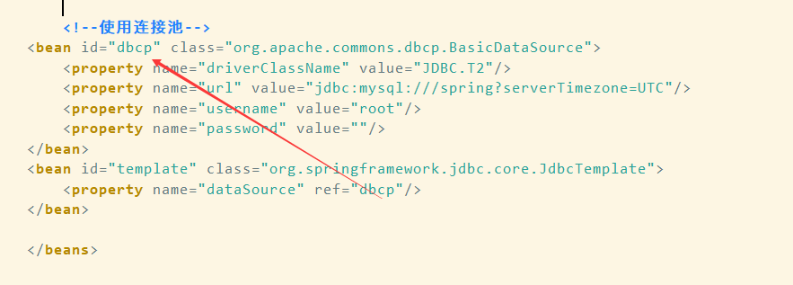
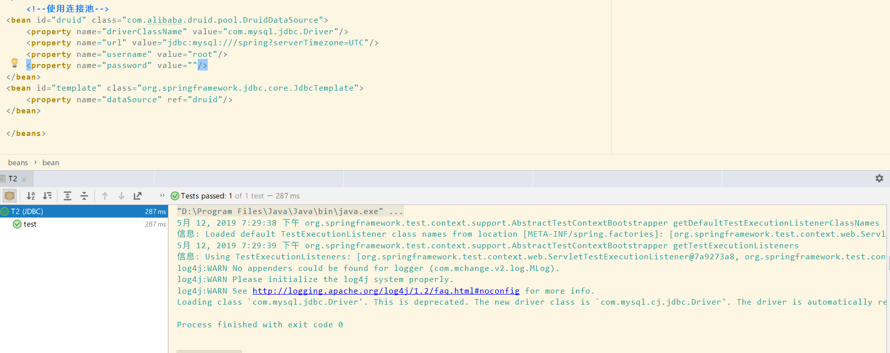

Spring框架会对定义在配置文件中的bean实例自动管理，也就是说Bean就是Java的实例Java组件

## 模板写法

Spring对JDBC也提供了很多方案。`org.springframework.jdbc.core.JdbcTemplate`

1. 导入Spring相关jar包，导入mysql包
2. 创建好数据库相关的库和表
3. 使用JDBC模板

```java
@Test
public void t1(){
		//1. 建立连接
		DriverManagerDataSource dataSource = new DriverManagerDataSource();
		dataSource.setDriverClassName("com.mysql.cj.jdbc.Driver");
		dataSource.setUrl("jdbc:mysql:///spring?serverTimezone=UTC");
		dataSource.setUsername("root");
		dataSource.setPassword("");

		System.out.println(dataSource);
		//2. 创建jdbc模板
		JdbcTemplate jdbcTemplate = new JdbcTemplate(dataSource);
		/**
		 *  更新数据
		 * */
		jdbcTemplate.update("update student set name = 'jack' where id=1");
		/**
		 *  插入数据
		 * */
		jdbcTemplate.update("insert into student values(?,?,?,?)",3,"Tashi",21,"Teacher");
}
```

**使用Spring**

1. 配置文件

```xml
<?xml version="1.0" encoding="UTF-8"?>
<beans xmlns="http://www.springframework.org/schema/beans"
       xmlns:xsi="http://www.w3.org/2001/XMLSchema-instance"
       xmlns:aop="http://www.springframework.org/schema/aop"
       xsi:schemaLocation="http://www.springframework.org/schema/beans
        http://www.springframework.org/schema/beans/spring-beans.xsd
        http://www.springframework.org/schema/aop
        http://www.springframework.org/schema/aop/spring-aop.xsd">

<!--AOP配置开启注解-->
<aop:aspectj-autoproxy/>
<bean id="datasource" class="org.springframework.jdbc.datasource.DriverManagerDataSource">
    <property name="driverClassName" value="JDBC.T2"/>
    <property name="url" value="jdbc:mysql:///spring?serverTimezone=UTC"/>
    <property name="username" value="root"/>
    <property name="password" value=""/>
</bean>
<bean id="template" class="org.springframework.jdbc.core.JdbcTemplate">
    <property name="dataSource" ref="datasource"/>
</bean>

</beans>
```

2. 测试

```java
//注解
@RunWith(SpringJUnit4ClassRunner.class)
@ContextConfiguration("classpath:applicationContext.xml")
public class T2 {
    @Autowired
    @Qualifier("template")//注入
    private JdbcTemplate jdbcTemplate;
    @Test
    public void test(){
        jdbcTemplate.update("insert into student values(?,?,?,?)",4,"TT",21,"Teacher");
    }
}
```

##### 连接池的配置

上面的测试都是默认的连接池，现在使用开源的连接池

1. 导入Jar包
2. 修改配置文件bean 的class

**dbcp连接池**

```xml
<bean id="dbcp" class="org.apache.commons.dbcp.BasicDataSource">
    //配置
</bean>
```



**c3p0连接池**

1. 导包
2. 修改class `com.mchange.v2.c3p0.ComboPooledDataSource`

```xml
<bean id="c3p0" class="com.mchange.v2.c3p0.ComboPooledDataSource">
    <property name="driverClass" value="com.mysql.jdbc.Driver"/>
    <property name="jdbcUrl" value="jdbc:mysql:///spring?serverTimezone=UTC"/>
    <property name="user" value="root"/>
    <property name="password" value=""/>
</bean>
```


需要注意的是属性的名字可能与其他有所不同。

**druid连接池**

```xml
<bean id="druid" class="com.alibaba.druid.pool.DruidDataSource">
    <property name="driverClassName" value="com.mysql.jdbc.Driver"/>
    <property name="url" value="jdbc:mysql:///spring?serverTimezone=UTC"/>
    <property name="username" value="root"/>
    <property name="password" value=""/>
</bean>
```



当然还可以添加更多的属性功能

```xml
<!--连接池的最大连接数-->
<property name="maxPoolSize" value="40"/>
<!--连接池的最小连接数-->
<property name="minPoolSize" value="1"/>
<!--指定连接池的初始化连接数-->
<property name="initialPoolSize" value="1"/>
<!--指定连接数据库连接池连接的最大空闲时间-->
<property name="maxIdleTime" value="20"/>
```

##### 加载properties文件

通过配置连接池我们发现写入配置文件方便了很多，那么现在将它写入properties文件 

**方式一<bean/>方式**

1. 创建jdbc.properties文件
2. 加载属性文件

```java
driverClass:com.mysql.jdbc.Driver
url:"jdbc:mysql:///spring?serverTimezone=UTC"
username:root
password:
```

```xml
<!--加载属性文件-->
<bean class="org.springframework.beans.factory.config.PropertyPlaceholderConfigurer">
		<property name="location" value="jdbc.properties"/>
</bean>
```


**方式二<context/>方式**
	
1. 引入属性文件
	
```xml
	<?xml version="1.0" encoding="UTF-8"?>
<beans xmlns="http://www.springframework.org/schema/beans"
       xmlns:xsi="http://www.w3.org/2001/XMLSchema-instance"
       xmlns:aop="http://www.springframework.org/schema/aop"
       xmlns:context="http://www.springframework.org/schema/context"
       xsi:schemaLocation="http://www.springframework.org/schema/beans
        http://www.springframework.org/schema/beans/spring-beans.xsd
        http://www.springframework.org/schema/context/spring
        http://www.springframework.org/schema/context/spring-context.xsd
        http://www.springframework.org/schema/aop
        http://www.springframework.org/schema/aop/spring-aop.xsd
">

<!--AOP配置开启注解-->
<aop:aspectj-autoproxy/>
<!--加载属性文件-->
<context:property-placeholder location="classpath:jdbc.properties"/>
<!--使用连接池-->
<bean id="druid1" class="com.alibaba.druid.pool.DruidDataSource">
    <!--注意：这里的value名称不能和配置文件的name一样-->
    <property name="driverClassName" value="${jdbc.driverClass}"/>
    <property name="url" value="${jdbc.url}"/>
    <property name="username" value="${jdbc.username}"/>
    <property name="password" value="${jdbc.password}"/>
</bean>
<bean id="template" class="org.springframework.jdbc.core.JdbcTemplate">
    <property name="dataSource" ref="druid1"/>
</bean>

</beans>
```


## CRUD操作

1. 已经配置好了数据库的连接
2. 测试

```java
import org.junit.Test;
import org.junit.runner.RunWith;
import org.springframework.beans.factory.annotation.Autowired;
import org.springframework.beans.factory.annotation.Qualifier;
import org.springframework.jdbc.core.JdbcTemplate;
import org.springframework.jdbc.core.RowMapper;
import org.springframework.test.context.ContextConfiguration;
import org.springframework.test.context.junit4.SpringJUnit4ClassRunner;

import java.sql.ResultSet;
import java.sql.SQLException;
import java.util.List;

//注解
@RunWith(SpringJUnit4ClassRunner.class)
@ContextConfiguration("classpath:applicationContext.xml")
public class T2 {
    @Autowired
    @Qualifier("template")//注入
    private JdbcTemplate jdbcTemplate;
    @Test
    public void insert(){
        jdbcTemplate.update("insert into student values(?,?,?,?)",2,"TT",21,"Teacher");
    }
    @Test
    public void update(){
        jdbcTemplate.update("update student set name=? where id=?","Luck",2);
    }
    @Test
    public void delete(){
        jdbcTemplate.update("delete from student where id=? ",2);
    }
    @Test
    public void query(){
        String s = jdbcTemplate.queryForObject("select name from student where id=?", String.class, 819);
        System.out.println(s);
    }
    @Test//查询单个对象所有
    public void queryAll(){
        Student student = jdbcTemplate.queryForObject("select * from student where id=?", new MyRowMap(), 819);
        System.out.println(student);
    }
    @Test//查询所有对象
    public void queryAll2(){
        List<Student> query = jdbcTemplate.query("select * from student", new MyRowMap());
        System.out.println(query);
    }
}
//查询所有
class MyRowMap implements RowMapper<Student>{

    @Override
    public Student mapRow(ResultSet rs, int rowNum) throws SQLException {
        Student student = new Student();
        student.setId(rs.getInt("id"));
        student.setName(rs.getString("name"));
        student.setAge(rs.getInt("age"));
        student.setJob(rs.getString("job"));
        return student;
    }
}
```


这里最麻烦的是查询操作。如果查询多个我们的操作是创建一个模型类用来返回， 创建测试类实现`RowMapper<对象>` 接口。并覆盖方法`mapRow()`  
	
	

