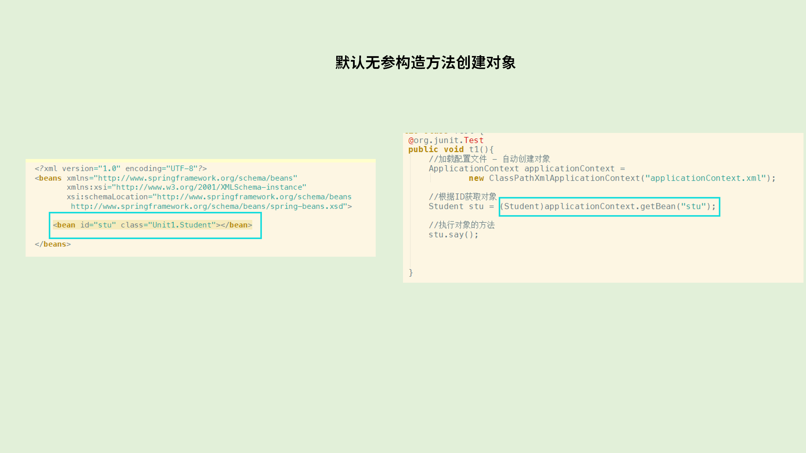
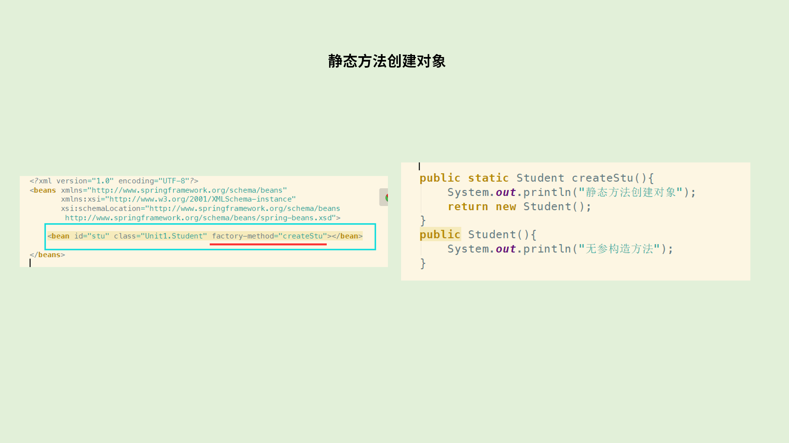

# Spring

Spring是一站式框架

- Web层  SpringMVC
- Service层 Spring的Bean管理
- Dao层 Spring的JDBC模板 Spring ORM模块


# （Inbersion Of Control）控制反转

将对象的创建权转给Spring


## 使用

> 下载

[http://repo.spring.io/libs-release-local/org/springframework/spring/](http://repo.spring.io/libs-release-local/org/springframework/spring/)

1. 添加Jar包
2. 创建配置文件`applicationContext.xml`

```xml
<?xml version="1.0" encoding="UTF-8"?>
<beans xmlns="http://www.springframework.org/schema/beans"
       xmlns:xsi="http://www.w3.org/2001/XMLSchema-instance"
       xsi:schemaLocation="http://www.springframework.org/schema/beans
        http://www.springframework.org/schema/beans/spring-beans.xsd">
	
		/*自定义对象的名字与类所在路径*/
    <bean id="stu" class="Unit1.Student"></bean>

</beans>
```
1.  测试

```java
/*创建好Student类*/

@org.junit.Test
public void t1(){
		//加载配置文件 参数填写配置文件路径
		//创建Spring容器
		ApplicationContext applicationContext =
						new ClassPathXmlApplicationContext("applicationContext.xml");

		//根据ID获取对象
		Student stu = (Student)applicationContext.getBean("stu");

		//执行对象的方法
		stu.say();
}
```

# DI(依赖注入)


**依赖注入**

前提必须具有环境，给Spring管理类当中依赖的属性，通过配置文件进行赋值的过程

配置文件(类中属性要Public还要提供set方法)

```xml
   <bean id="stu" class="Unit1.Student">
        <!--
            name:注入的名称
            value:注入的值
        -->
        <property name="name" value="张三" />
    </bean>
```

# 工厂类

- BeanFactory
- ApplicationContext（加载配置文件就会创建好实例对象）
- ApplicationContext 实现类
	- 根据路径配置文件常见类`ClassPathXmlApplicationContext`
	- 加载文件系统下的配置文件`FileSystemXmlApplicationContext`


# Bean相关配置

核心配置文件信息

beans标签是配置文件的根元素 它可以有多个bean元素的子元素。每个bean元素代表了一个Java组件。

> Bean标签

- id 指向该Bean的唯一标识，程序通过id属性值访问bean实例 
- class  类路径，实现类，利用反射来创建该实现类的实例
- scope  bean的作用范围
	- singleton 单例(默认值：无论创建多少对象都是一个)
	- prototype 多例模式
	- request 这个类存在req范围中
	- session 这个类存在session范围中
	- globalsession  应用在web应用中 须在porlet环境下使用
  

**生命周期**

- init-method 初始化执行的方法
- destory-method 销毁执行的方法

初始化就会先执行Student类的init()方法。

```xml
<bean id="stu" class="Unit1.Student" init-method="init" destroy-method="des">
		<!--
				name:注入的名称
				value:注入的值
		-->
		<property name="name" value="张三" />

</bean>
```

```java
 @org.junit.Test
public void t1(){
		//加载配置文件 - 自动创建对象
		ApplicationContext applicationContext =
						new ClassPathXmlApplicationContext("applicationContext.xml");

		//根据ID获取对象
		Student stu = (Student)applicationContext.getBean("stu");

		//执行对象的方法
		stu.say();


		//关闭工程 - 销毁
		((ClassPathXmlApplicationContext) applicationContext).close();


}
```

##### **工厂实例化方式**

- 无参构造
- 静态工厂
- 实例工厂






##### 分模块配置

可以将自己单独的模块做出配置 然后再引入即可

- 方式一：在引入配置文件添加多个参数

```java
public void t1(){
        //加载配置文件 - 自动创建对象
        ApplicationContext applicationContext =
                new ClassPathXmlApplicationContext("applicationContext.xml","self.xml");
    }
```

- 方式二：配置文件引入其他配置文件

All

```xml
<?xml version="1.0" encoding="UTF-8"?>
<beans xmlns="http://www.springframework.org/schema/beans"
       xmlns:xsi="http://www.w3.org/2001/XMLSchema-instance"
       xsi:schemaLocation="http://www.springframework.org/schema/beans
        http://www.springframework.org/schema/beans/spring-beans.xsd">

    <import resource="self.xml"/>

</beans>
```


Self

```xml
<?xml version="1.0" encoding="UTF-8"?>
<beans xmlns="http://www.springframework.org/schema/beans"
       xmlns:xsi="http://www.w3.org/2001/XMLSchema-instance"
       xsi:schemaLocation="http://www.springframework.org/schema/beans
        http://www.springframework.org/schema/beans/spring-beans.xsd">

    <bean id="tea" class="Unit1.Teacher"></bean>
    <bean id="stu" class="Unit1.Student" factory-bean="tea"></bean>

</beans>
```


##### 补充

每次请求都会创建Spring工厂，浪费服务器资源

**解决**

1. 在服务器启动的时候创建Spring工厂
2. 将工厂保存在ServletContext中
3. 每次获取工厂从ServletContext中获取

**Demo**

1. 引入spring_web.jar包
2. 配置修改加载配置文件的路径
3. 通过工具类获取工具


