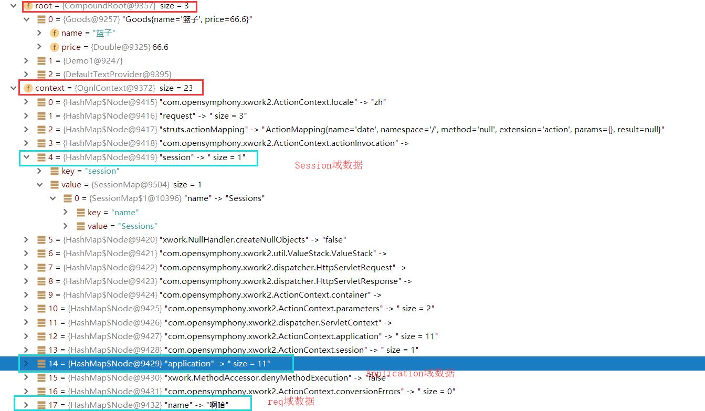

# Ognl(Object-Graph Navigation Language)

**是什么**

强大的表达式语言，通过它简单一致的表达式语法。可以存取对象的属性，调用对象的方法。遍历整个对象

**与EL表达式优势**

OGNL 对象图像导航语言。EL表达式只能从域中获取数据。OGNL可以调用对象方法，获取struts值栈的数据

**功能**

- 支持运算符
- 对象方法
- 静态方法调用
- 访问OGNL上下文
- 操作集合对象
- 可以创建对象

**使用要素**

1. 表达式
2. 根对象
3. Context对象


## 基本使用

Ognl核心OgnlContext()

#### 存取数据

**根对象存取数据**

```java
@org.junit.Test
    public void t1() throws OgnlException {
        //Ognl 使用
        OgnlContext ognlContext = new OgnlContext();

        Student stu = new Student();
        stu.setName("张三");
        stu.setAge(26);
        stu.setJob("Student");
        stu.setSchool("Home Learn");

        ognlContext.setRoot(stu);//存数据 根对象


        /*取所有数据
        *
        *》》》 Student{name='张三', age=26, job='Student', school='Home Learn'}
         * */
        Object root = Ognl.getRoot(ognlContext);
        System.out.println(root);
				
        /*
        *   取单个数据
        * 》》》张三
        * */
        Object root1 = ognlContext.getRoot();
        Object name = Ognl.getValue("name", ognlContext, root1);
        System.out.println(name);
    }
```

**非根对象存取数据**

```java
@org.junit.Test
public void f2() throws OgnlException {
		OgnlContext ognlContext = new OgnlContext();

		Student stu = new Student();/*对象*/
		stu.setName("张三");
		stu.setAge(26);
		stu.setJob("Student");
		stu.setSchool("Home Learn");


		ognlContext.put("Student",stu);

		//获取root
		Object root = ognlContext.getRoot();

		Student astu = (Student)Ognl.getValue("#Student", ognlContext,root);
		System.out.println(astu);
}
```

注意点：非根对象不可以取单一字段取的时候取的就是存的内容。表达式前加上#

#### 调用方法

- 调用普通方法
- 调用静态方法

```
@org.junit.Test
public void f3() throws OgnlException {
		OgnlContext ognlContext = new OgnlContext();
		Object root = ognlContext.getRoot();

		//调用普通方法
		Object value = Ognl.getValue("'hello'.length()", ognlContext,root );
		System.out.println(value);
System.out.println(Integer.MAX_VALUE);

		//调用静态方法
		Object value1 = Ognl.getValue("@java.lang.Math@random()", ognlContext, root);
		System.out.println(value1);
}
```

# 值栈

ValueStack实际上就是一个容器。是一个接口，实现类是OgnlValueStack。

当用于访问action对象的业务方法时首先会创建ActionContext对象。OgnlValueStack对象Action对象。

Struts默认拦截器会将请求中的数据进行封装。并入ValueStack栈顶。

Struts框架数据都保存在ValueStack中，不存域中。因为存到域中只能在页面中进行提取。而在栈值中可以在任意地方取出数据。

ValueStack贯穿整个action生命周期。action一旦创建，就会创建一个valuestack对象。


### 值栈的内部结构

值栈分为根区与非根区


根区：存放当前action相关数据

非根区：是一些整个程序相关数据 比如req域、 session域 、application域。

```java
public String execute(){
		System.out.println(goods);

		//获取值栈
		ValueStack valueStack = ActionContext.getContext().getValueStack();

		/*域中写入信息*/
		ActionContext.getContext().put("name", "啊哈");
		ActionContext.getContext().getSession().put("name", "Sessions");
		ActionContext.getContext().getApplication().put("name","Application" );

		System.out.println(valueStack);

		return null;
}
```

通过查看断点




#### 存放数据与出栈


**根区**

```
//获取值栈
ValueStack valueStack = ActionContext.getContext().getValueStack();

valueStack.push(); /*两个方法等价*/
valueStack.getRoot().push();

```

**非根区**

```
//获取值栈
ValueStack valueStack = ActionContext.getContext().getValueStack();

ActionContext.getContext().put("name", "啊哈");
```


如果出栈则使用`pop()`方法

##### 在页面调试数据

1. 打开开发者模式

```
<constant name="struts.devMode" value="true"></constant>
```

2. JSP页面

```
<%@ taglib prefix="s" uri="/struts-tags"%>


<s:debug></s:debug>
```


#### 页面展示数据

**取根元素**

```
<a href="date.action?name=篮子&price=66.6">Click！</a>
```

```
<!--Success.jsp-->
<%@ taglib prefix="s" uri="/struts-tags"%>


<s:property  value="name"/>
<s:property value="price"></s:property>
```

直接就可以取出栈顶元素。

**非根元素**

`#`+名称

```
<s:property value="#name"/>
<s:property value="#session.name"/> #获取session域数据
<s:property value="#application.name"/> #获取application域数据
```

**调用方法**

```
<s:property  value="'itao'.length()"/>
```

**静态方法**

```
<!--允许静态访问-->
<constant name="struts.ognl.allowStaticMethodAccess" value="true"></constant>
```

```
<s:property value="@java.lang.Math@random()"/>
```


