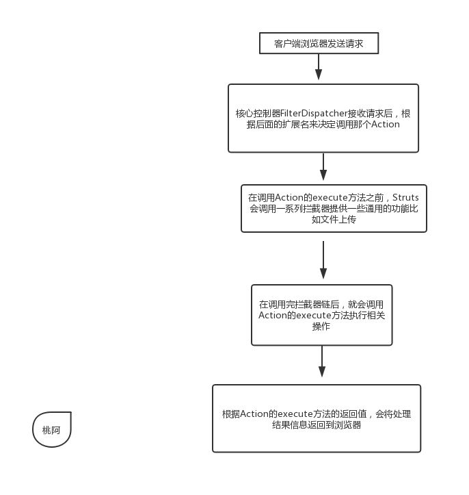
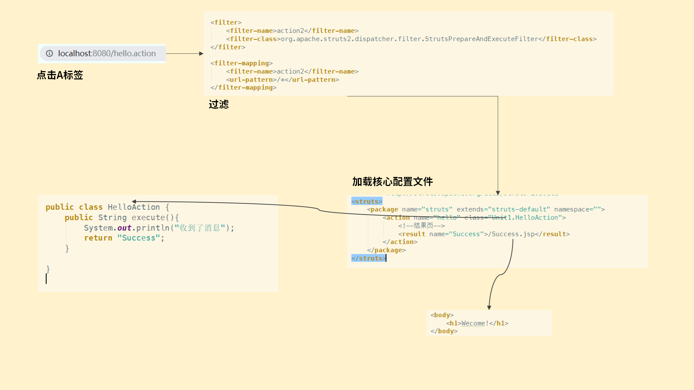

## 简介

Stuts2是一个基于MVC设计的web应用框架。

**执行流程**



#### 使用

1. 创建web工程
2. 引入jar包
3. 创建jsp文件

```
<a href="hello.action">Yo!</a>
```

4. 编写Action类

Action类是最基本的逻辑处理单元，在MVC模式中分发器分给不同的Action类来处理请求。

```java
public class HelloAction {
    public String execute(){
        System.out.println("收到了请求");

        return "Success";//返回结果
    }
}
```

5. 创建配置文件`struts.xml`

所有的请求与分发以及其他配置都在这个文件里定义。

```java
<?xml version="1.0" encoding="UTF-8" ?>

<!DOCTYPE struts PUBLIC
        "-//Apache Software Foundation//DTD Struts Configuration 2.5//EN"
        "http://struts.apache.org/dtds/struts-2.5.dtd">
<struts>
    <package name="struts" extends="struts-default">
        <action name="hello" class="Unit1.HelloAction">
            <!--结果页-->
            <result name="Success">/tao.jsp</result>
        </action>
    </package>
</struts>
```

6. 前端控制器`web.xml`

这个配置非常简单，提供简单的过滤器 并设置所有的请求(/*) 都要通过这个过滤器

```java
<?xml version="1.0" encoding="UTF-8"?>
<web-app xmlns="http://xmlns.jcp.org/xml/ns/javaee"
         xmlns:xsi="http://www.w3.org/2001/XMLSchema-instance"
         xsi:schemaLocation="http://xmlns.jcp.org/xml/ns/javaee http://xmlns.jcp.org/xml/ns/javaee/web-app_4_0.xsd"
         version="4.0">

    <filter>
        <filter-name>action2</filter-name>
        <filter-class>org.apache.struts2.dispatcher.filter.StrutsPrepareAndExecuteFilter</filter-class>
    </filter>

    <filter-mapping>
        <filter-name>action2</filter-name>
        <url-pattern>/*</url-pattern>
    </filter-mapping>

</web-app>
```

#### 执行流程



##### 配置文件加载顺序

**源码**

- init_DefaultProperties();
- init_TraditionalXmlConfigurations();
- init_LegacyStrutsProperties();
- init_CustomConfigurationProviders();
- init_FilterInitParameters();
- init_AliasStandardObjects();

**配置文件加载顺序**

- default.properties
- struts-default.xml
- struts-plugin.xml
- struts.xml
- struts.properties
- web.xml

注意：后配的会把前配置的覆盖

##### 配置文件细解

常用的配置文件`web.xml`  `struts.xml`  `struts.properties`  `struts-default.xml`


`struts.xml`

struts.xml主要用来建立动作Action类与视图的映射。这个文件以<struts>为根元素的，子元素包括package、constant、bean、include。

package包，这个包为了更好管理action配置

- name 包的名称不能重名
- extends 继承那个包。
- namespace 命名空间。与action标签的name属性共同决定了路径访问
- abstract 为了让别人继承而使用的。

action
	
action用来定义一个动作，每个动作都需要一个名称反应动作的含义。

- name
- class 类的全路径
- method 执行Action中的那个方法
- converter 自定义类型转换器

result
	
它用来指定结果类型，即定义在动作完成后将控制权转到那里。一个action可能会有多个result元素，每个元素对应动作方法的一种返回值。

**常量配置**

在struts2修该常量。可以在struts.xml中进行修改。也可以在struts.properties修改web.xml中修改。

```xml
<!--struts.xml-->
<constant name="___" value="___" />
```

```xml
<filter>
	...
	<init-param>
		<param-name></param-name>
		<param-value></param-value>
	</init-param>
<filter>
```

**include**

配置文件可以引入其他配置文件。适合团队合作开发

```xml
<!--struts.xml-->
<include file="itao.xml">
```

`web.xml`

Web应用都应该有一个配置文件`web.xml` 文件用来对整个应用程序进行配置。

**配置Struts2核心的名称和实现类**

```
<filter>
		<filter-name>action2</filter-name>
		<filter-class>org.apache.struts2.dispatcher.filter.StrutsPrepareAndExecuteFilter</filter-class>
</filter>
```

**使用配置的Filter名称拦截所有URL请求**

```
<filter-mapping>
		<filter-name>action2</filter-name>
		<url-pattern>/*</url-pattern>
</filter-mapping>
```

#### Action类的写法

Action起始就是一个普通的Java类。类包含一个execute()方法

- 普通类
- 接口Action
- 继承ActionSupport

```java
public class HelloAction {
    public String execute(){
        System.out.println("收到了请求!");

        return "Success";//返回结果
    }
}
```


接口定义了5个常量可以直接拿来使用

`String SUCCESS="success"`  `None` `ERROR` `INPUT`  `LOGIN`

```java
import com.opensymphony.xwork2.Action;

public class Method1 implements Action {

    @Override
    public String execute() throws Exception {

        return SUCCESS;
    }
}
```


```
import com.opensymphony.xwork2.ActionSupport;

public class Method2 extends ActionSupport {
    @Override
    public String execute() throws Exception {
      
        return SUCCESS;//返回成功
    }
}
```

#### Action方法访问

**常规写法**

```
<!--index.jsp-->
<body>
	<a href="add.action">添加</a>
	<a href="del.action">删除</a>
	<a href="update.action">修改</a>
	<a href="find.action">查看</a>
</body>
```

```
<package name="ac_method" extends="struts-default" namespace="">
		<action name="add" class="Unit1.Method1" method="add"></action>
		<action name="del" class="Unit1.Method1" method="del"></action>
		<action name="update" class="Unit1.Method1" method="update"></action>
		<action name="find" class="Unit1.Method1" method="find"></action>
</package>
```

```
import com.opensymphony.xwork2.ActionSupport;

public class Method1 extends ActionSupport {
    public String add(){
        System.out.println("Click 添加");
        return null;
    }

    public String del(){
        System.out.println("Click 删除");
        return null;
    }

    public String update(){
        System.out.println("Click 修改");
        return null;
    }

    public String find(){
        System.out.println("Click 查看");
        return null;
    }

}
```

简单写法 **通配符写法**

```
<a href="goods_add.action">添加</a>
<a href="goods_del.action">删除</a>
<a href="goods_update.action">修改</a>
<a href="goods_find.action">查看</a>
```

method="{1}" 1表示前面匹配第几个*。

```xml
<!--___.xml-->
<package name="ac_method" extends="struts-default" namespace="">
		<action name="goods_*" class="Unit1.Method1" method="{1}">
				<!-- 允许通过通配符访问的方法 -->
				<allowed-methods>add,update,del,find</allowed-methods>
		</action>
</package>
```

使用通配符调用方法，需要在内部验证是否允许访问该方法。

**动态方法访问**

默认不开启动态访问的，所以要修改

```
<constant name="struts.enable.DynamicMethodInvocation" value="true"></constant>
<package name="ac_method" extends="struts-default" namespace="">
		<action name="goods" class="Unit1.Method1">
				<!-- 允许通过通配符访问的方法 -->
				<allowed-methods>add,update,del,find</allowed-methods>
		</action>
</package>
```


```
<a href="goods!add.action">添加</a>
<a href="goods!del.action">删除</a>
<a href="goods!update.action">修改</a>
<a href="goods!find.action">查看</a>
```


