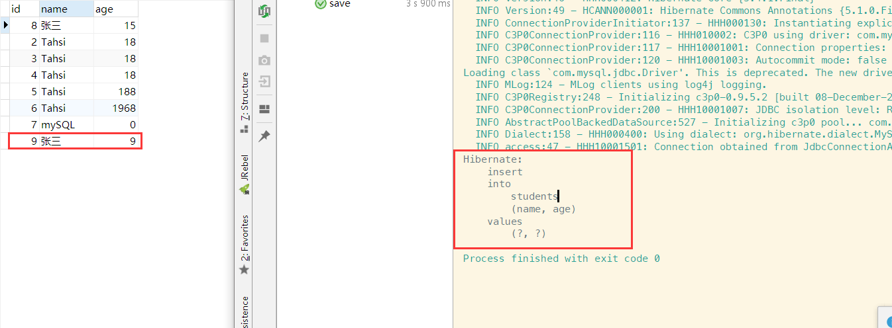
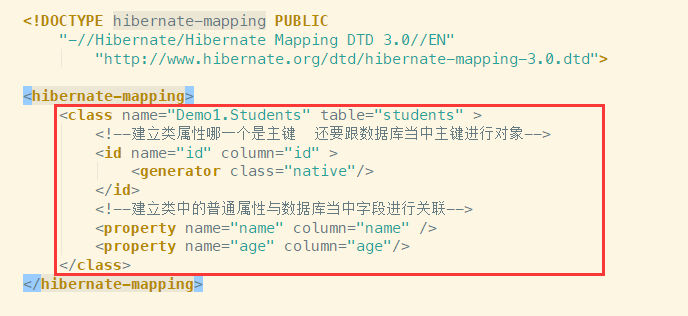
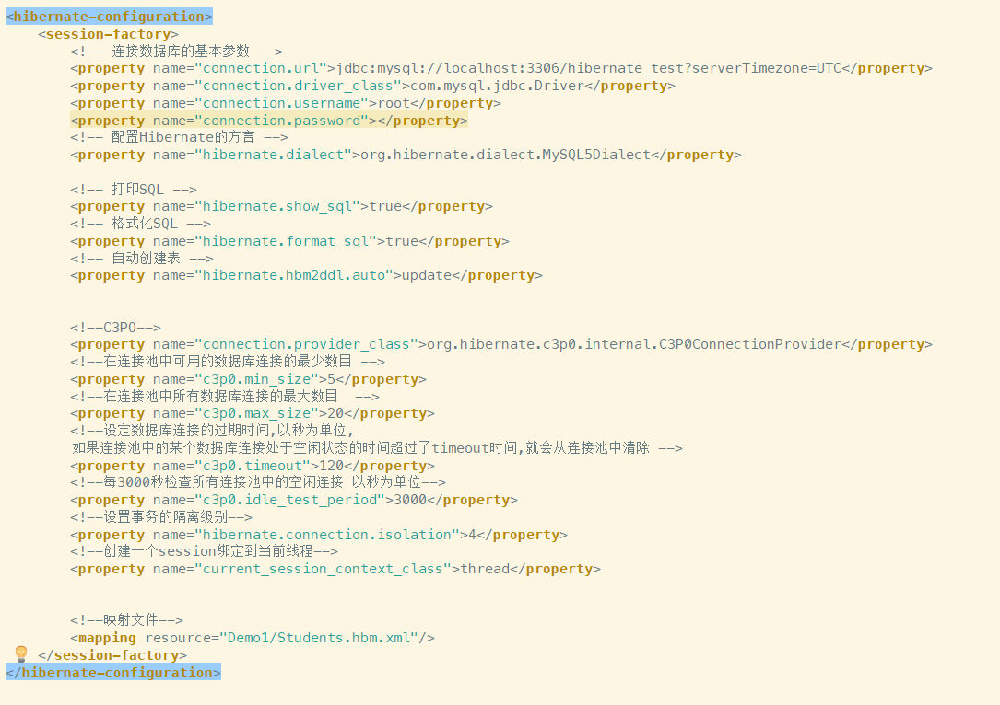
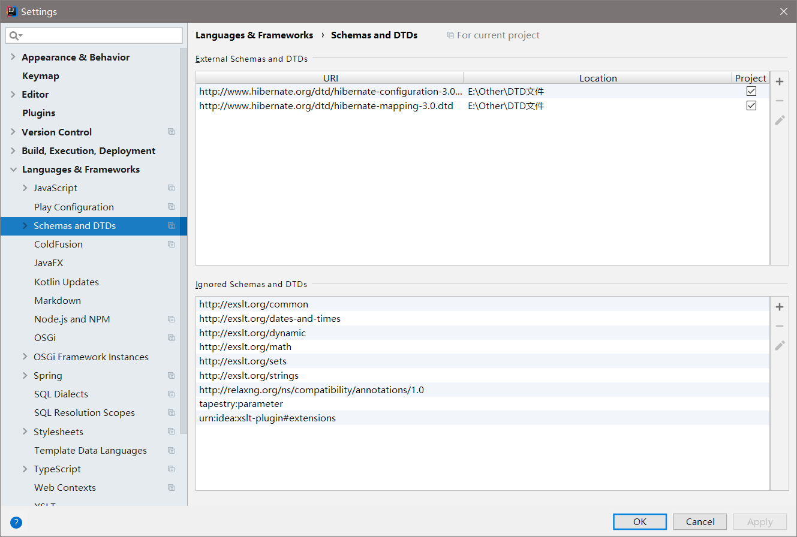

> 什么是持久化技术


持久化技术。就是把数据保存到可永久保存的存储设备中。持久化的主要应用是将内存中的对象存储在关系型数据库中。


> 什么是ORM

对象关系映射。

通过ORM我们可以通过类的方式去操作数据库，而不用原生的SQL语句。通过把表映射成类，把行当作实例，把字段当作属性。

ORM在执行对象操作的时候最终还是会把对应的操作转换为数据库原生语句。


#### 新建工程

**步骤**


1. 导入相关的包
2. 创建orm类
3. 创建Hibernate核心配置文件
4. 创建映射关系
5. 创建类执行


**导包**

- 必须依赖的包hibernate-release-5.3.1.Final\lib\required
- 数据库包
- c3p0连接池c3p0.jar
- 单元测试junit-4.9.jar

**创建ORM类**

```java
//学生类
import lombok.Getter;
import lombok.Setter;

@Getter@Setter
public class Students {
   private int id;
   private String name;
   private int age;

   @Override
   public String toString() {
      return "Students{" +
              "id=" + id +
              ", name='" + name + '\'' +
              ", age=" + age +
              '}';
   }
}
```

**核心配置文件**

`hibernate.cfg.xml`

```xml
<!DOCTYPE hibernate-configuration PUBLIC
	"-//Hibernate/Hibernate Configuration DTD 3.0//EN"
	"http://www.hibernate.org/dtd/hibernate-configuration-3.0.dtd">

<hibernate-configuration>
    <session-factory>
        <!-- 连接数据库的基本参数 -->
        <property name="connection.url">jdbc:mysql://localhost:3306/hibernate_test?serverTimezone=UTC</property>
        <property name="connection.driver_class">com.mysql.jdbc.Driver</property>
        <property name="connection.username">root</property>
        <property name="connection.password"></property>
        <!-- 配置Hibernate的方言 -->
        <property name="hibernate.dialect">org.hibernate.dialect.MySQL5Dialect</property>

        <!-- 打印SQL -->
        <property name="hibernate.show_sql">true</property>
        <!-- 格式化SQL -->
        <property name="hibernate.format_sql">true</property>
        <!-- 自动创建表 -->
        <property name="hibernate.hbm2ddl.auto">update</property>
        <mapping resource="Demo1/Students.hbm.xml"/>
    </session-factory>
</hibernate-configuration>
```


**创建映射关系**

通过xml的配置进行配置。


```xml
<?xml version="1.0" encoding="UTF-8"?>

<!DOCTYPE hibernate-mapping PUBLIC
    "-//Hibernate/Hibernate Mapping DTD 3.0//EN"
        "http://www.hibernate.org/dtd/hibernate-mapping-3.0.dtd">

<hibernate-mapping>
    <class name="Demo1.Students" table="students" >
        <!--建立类属性哪一个是主键  还要跟数据库当中主键进行对象-->
        <id name="id" column="id" >
            <generator class="native"/>
        </id>
        <!--建立类中的普通属性与数据库当中字段进行关联-->
        <property name="name" column="name" />
        <property name="age" column="age"/>
    </class>
</hibernate-mapping>
```

**执行**

```java
import org.hibernate.Session;
import org.hibernate.SessionFactory;
import org.hibernate.Transaction;
import org.hibernate.cfg.Configuration;

@Test
    public void save(){
        /*1.加载配置文件*/
        Configuration configure = new Configuration().configure();

        /*2. 创建会话工厂 - JDBC连接 */
        SessionFactory sessionFactory = configure.buildSessionFactory();

        /*3. 获取session - JDBC连接对象 */
        Session session = sessionFactory.openSession();

        Students per = new Students();
        per.setId(15);
        per.setName("张三");
        per.setAge(15);


        session.save(per);

        /*释放资源*/
        session.close();
        sessionFactory.close();
    }
```




## 解析

**映射配置**


xxx.hbm.xml

xxx对应持久化类后面的.hbm.xml是固定写法



`hibernate-mapping标签`

注意的是一个映射文件只可以有一个hibernate-mapping标签

`class标签`

作用：建立类与表的映射关系

属性：

- name 类的全路径
- table 表名。类名与表名一直，table可以省略，如果没有该表，自动创建表
- catalog
- proxy 代理设置 为延迟加载提供支持
- lazy 是否使用延迟加载
- dynamic-update 指定生成Update SQL 时是否仅包含发生变动的字段
- dynamic-insert 指定生成InsertSQL 时是否包含非空字段
- mutable 类的实例是否可变

`id标签`

作用：建立类中的属性与表中的主键对应关系

属性：

- name 属性的名称
- column 数据库中主键的名称
- length 
- type hibernate类型

`property标签`

作用：建立类中的普通属性与表的对应关系

- name
- type
- column
- access 
- not-null 属性值是否可以为空
- generated 是否由数据库生成

**核心配置**

hibernate.cfg.xml

当程序调用Configuration对象的configure()方法时，Hibernate就会自动加载该文件。hibernate-configuration是根元素。根元素包含session-factory子元素子元素又有property元素，而这些property属性则是配置Hibernate连接数据库的重要信息



自动建表`hibernate.hbm2ddl.auto`

格式化SQL`hibernate.format_sql`

显示SQL `hibernate.show_sql`


**DTD配置**

File -> Settings -> Sehemas and DTD



**配置连接池**

```xml
<!--C3PO-->
<property name="connection.provider_class">org.hibernate.c3p0.internal.C3P0ConnectionProvider</property>
<!--在连接池中可用的数据库连接的最少数目 -->
<property name="c3p0.min_size">5</property>
<!--在连接池中所有数据库连接的最大数目  -->
<property name="c3p0.max_size">20</property>
<!--设定数据库连接的过期时间,以秒为单位,
如果连接池中的某个数据库连接处于空闲状态的时间超过了timeout时间,就会从连接池中清除 -->
<property name="c3p0.timeout">120</property>
<!--每3000秒检查所有连接池中的空闲连接 以秒为单位-->
<property name="c3p0.idle_test_period">3000</property>
<!--设置事务的隔离级别-->
<property name="hibernate.connection.isolation">4</property>
<!--创建一个session绑定到当前线程-->
<property name="current_session_context_class">thread</property>
```

## 日志查看

**导包**

`log4j-1.2.16.jar` 

`log4j.preperties`放在src目录下

**级别**

- error
- warn
- info
- debug默认
- trace

