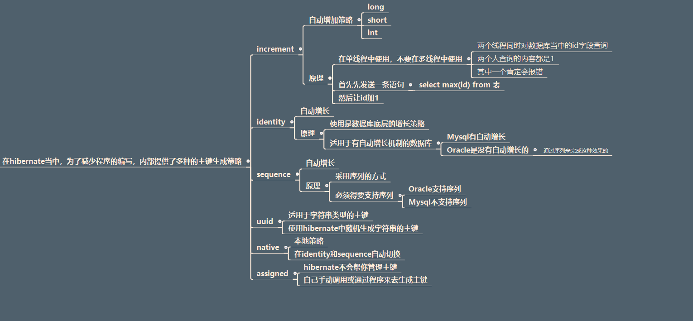
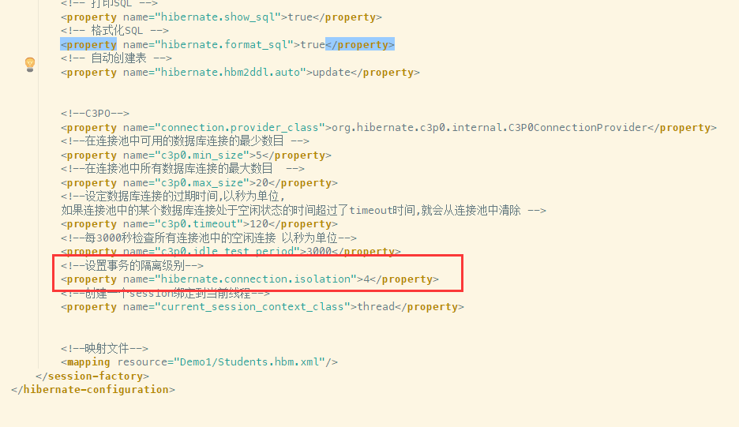

> 概要

- 主键生成策略
- 持久化
- 一级缓存
- 事务管理

## 主键生成策略



## 持久化

**是什么**

将内存中的一个对象持久化到数据库的过程。Hibernate框架是一个持久化的框架

**持久化类**

Java类+映射文件

**编写步骤**

1. 对持久化类提供一个无参的构造方法。因为底层会通过反射创建对象
2. 对内部私有的字段提供get方法与post方法。
3. 对象持久化类提供一个ID与数据库当中的主键对应
4. 持久化类中的属性使用包装类型

**持久化划分**

- 瞬时态
- 持久态
- 游离态、托管态

瞬时态，刚new出对象时，还没有设置id，还没有被session管理。 持久态，拥有了id调用session方法，把对象给session被session管理 添加到session之后，对象一直处于持久态。游离态，把session关闭(close)。需要注意的是，持久态的对象会自动更新数据库。


## 一级缓存

**是什么**

将数据存入到内存当中，使用的时候直接从缓存中获取

**一级缓存的特点**

1. 当调用save(),update(),saveOrUpdate() 时如果session缓存没有相应的对象，则会自动从数据库查询相应的信息。
2. 当调用load(),get() 方法，以及Query 接口的list iterator方法会判断缓存当中是否存在该对象，有则返回，不会查询数据库。

```java
@org.junit.Test
    public void T9(){
        Session session = HibernateUtil.openSession();
        //开启事务
        Transaction transaction = session.beginTransaction();

        Students stu1 = session.get(Students.class, 3);
        System.out.println(stu1);//会自动把数据存放到一级缓存

        Students stu2 = session.get(Students.class, 3);//直接使用上个数据
        System.out.println(stu2);

        System.out.println(stu1 == stu2 );

        //提交
        transaction.commit();
        //释放资源
        session.close();
    }
```

## 事务管理

Hibernate设置事务的隔离级别。在核心配置文件`hibernate.cfg.xml`配置，通过数字来代表不同的隔离级别。





