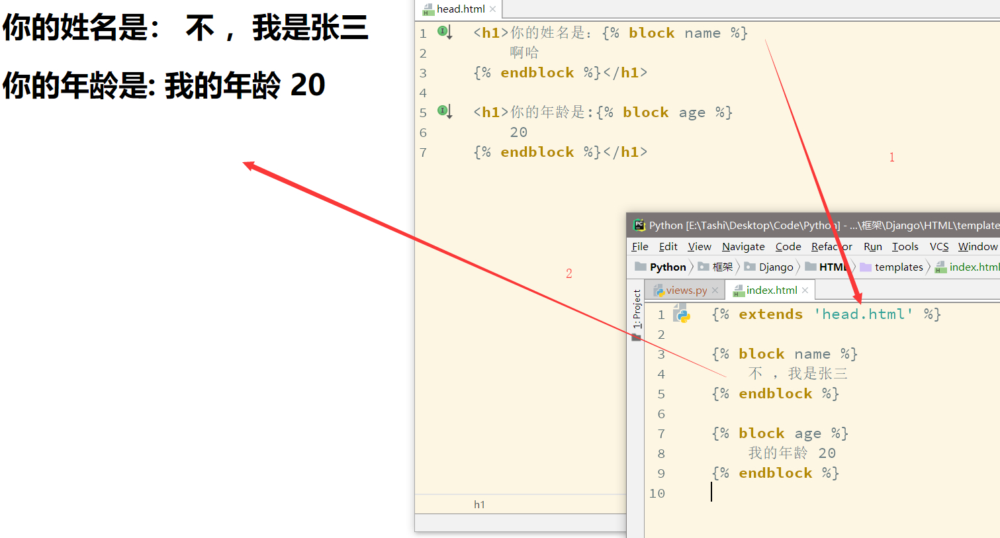
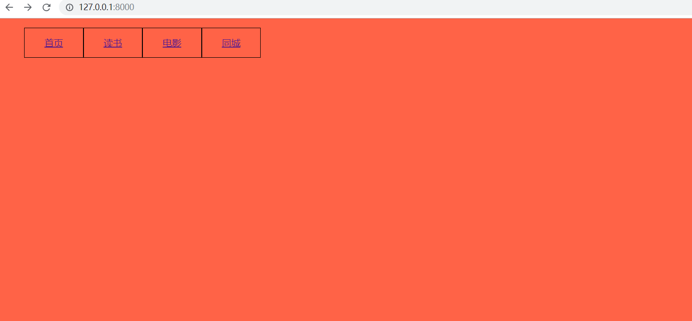

# 模板Template


**怎样动态生成HTML？**

模板技术。模板包含所需HTML页面的静态部分，以及一些特殊的模版语法，用于将动态内容插入静态部分

视图函数可以直接返回文本，若是要浏览器渲染出漂亮的HTML页面，需要模板系统，知名有DTL和Jinja2.

DTL是Django Template Language三个单词的缩写，也就是Django自带的模板语言

> HTML 与 DTL文件的区别

DTL模板是一种带有特殊语法的HTML文件。它可以被Django编译，可以传递参数，实现数据动态化。 在编译完成后，生成一个普通的HTML文件，然后发送客户端

### 主要分类

- 变量
- 标签
- 过滤器

### 配置引擎

模板引擎通过settings中的TEMPLATES设置来配置。这是一个列表，与引擎一一对应，每个元素都是一个引擎配置字典。由startproject命令生成的settings.py会自定定义如下的值

**模板查找路径配置**

在项目的`settings.py`文件中。有一个`TEMPLATES`配置。它包含了模板引擎的配置，模板查找路径的配置，这个模板上下文配置等。

`DIRS`这是一个空列表，存放所有的模板路径。使用`render_to_string render`渲染模板 会优先在这个列表路径查找

`APP_DIRS`默认True。 会在`INSTALLED_APPS`安装的APP下的`templates`文件中查找模板

修改`'DIRS':[os.path.join(BASE_DIR,'templates').replace('\\','/')],`这样就可以在APP内创建templates文件夹内放置模板文件

**如果想要在APP下创建HTML文件**

`settings.py`配置`TEMPLATES`的`'APP_DIRS': True`

`INSTALLED_APPS`添加APP文件名

### 渲染模板

两种方式

- reader_to_string

找到模板，然后将模板编译后的渲染Python字符串格式。最后通过HttpResponse类包装成一个HttpResponse对象返回回去

```python
from django.shortcuts import render
from django.http import HttpResponse
from django.template.loader import render_to_string
def index(request):
    html = render_to_string('index.html')
    return HttpResponse(html)
```

- render

直接将模板渲染成字符串和包装成HttpResponse对象

```python
from django.shortcuts import render
from django.http import HttpResponse
# Create your views here.

def index(request):
    return render(request, 'index.html')
```

---

# 基本语法

## 变量

模板中可以包含变量，在渲染模板的时候，可以传递变量对应的值进行替换。

变量在视图函数渲染，视图函数需要添加`context`字典


- 在模板中使用变量， 需要将变量放到 大括号里 中
- 如果访问对象的属性，可以通过`对象.属性名`来进行访问
- 如果访问一个字典的key对应的value，通过`字典.key`的方式访问，不可以通过`[ ]`来访问

```python
def index(request):
	context = {}
	context['UserName':'Tashi']
	return render(request,"index.html", context=context)
	

<h1>{{UserName}}</h1>
```

字典查询，属性查询和列表索引查找都是通过圆点符号.来实现。

## 标签

|标签|	说明|
| ------------ | ------------ |
|autoescape|	自动转义开关|
|block|	块引用|
|comment|	注释|
|csrf_token|	CSRF令牌|
|cycle	|循环对象的值|
|debug	|调试模式|
|extends|继承模版|
|filter	|过滤功能|
|firstof	|输出第一个不为False的参数|
|for	|循环对象|
|for … empty	|带empty说明的循环|
|if	|条件判断|
|ifequal	|如果等于|
|ifnotequal|	如果不等于|
|ifchanged	|如果有变化，则..|
|include	|导入子模版的内容|
|load	|加载标签和过滤器|
|lorem	|生成无用的废话|
|now	|当前时间|
|regroup	|根据对象重组集合|
|resetcycle	|重置循环|
|spaceless	|去除空白|
|templatetag|	转义模版标签符号|
|url	|获取url字符串|
|verbatim|	禁用模版引擎|
|widthratio|	宽度比例|
|with	|上下文变量管理器|

#### if标签-条件判断

- `if...elif...else...`
- `if...in...`
- `闭合标签 % endif %`

```
from django.shortcuts import render
from django.http import HttpResponse
from django.template.loader import render_to_string
def index(request):
    #context必须为字典形式
    context = {
        "age":18
    }
    return render(request, 'index.html', context=context)



    <p>未成年</p>

    <p>满18</p>

    <p>成年人</p>

```

```

	<P>信息</P>
```

#### for标签-循环

`for...in...`

```python
def index(request):
    #context必须为字典形式
    context = {
        "book":['三国演义', '水浒传', '红楼梦', '西游记']
    }
    return render(request, 'index.html', context=context)



   {{ i }}

```


`for...in...` 反转

```python

   {{ i }}

```


`遍历字典`

```python
def index(request):
    #context必须为字典形式
    context = {
        "Person":{
            "username":['小红', '小花', '小明'],
            "age":18
        }
    }
    return render(request, 'index.html', context=context)


    <p>Key: {{ key}}</p>
    <p>Value: {{ value }}</p>

```


**在for循环中，DTL提供了一些变量提供使用**

1. `forloop.counter`当前循环的下标，以1起始
2. `forloop.counter0`以0开始
3. `forloop.revcunter`反向遍历
4. `forloop.first`是否第一次遍历
5. `forloop.last`是否最后一次遍历
6. `forloop.parentloop`如果多个循环嵌套，那么这个属性代表是上一级的for循环

`for...in...empty`

与for...in...不同的是，在遍历对象如果没有元素的情况下，会执行empty中的内容

```python

pass

pass

```

#### 模板继承



父模版的% block %标签中的内容总是被用作默认内容


#### 转义标签

- `<`会转换为`&lt;`
- `>`会转换为`&gt;`
- `'`（单引号）转换为`&#39;`
- `"`双引号)会转换为`&quot;`
- `&`会转换为`&amp;`


#### with标签

```
定义变量
% with  zs=Age  %
    <h1>{{ zs }}</h1>
% endwith %
```

#### URL标签
urls.py
```python
urlpatterns = [
    path('', views.index),#首页
    path('book/', views.book, name='book'),
    path('movie/', views.movie, name='movie'),
    path('city/', views.city, name='city')
]
```

views.py
```python
def index(request):
    #context必须为字典形式
    return render(request, 'index.html')

def book(request):
    return HttpResponse('读书页面')

def movie(request):
    return HttpResponse('电影页面')

def city(request):
    return HttpResponse('同城页面')
```




**总结**
```
1. <a href=""> </a>
2. <a href=""> </a>
3. <a href="?参数=值 参数=值"> </a>
```


```
http://127.0.0.1:8000/book/info/1

http://127.0.0.1:8000/login/?user="Tashi"&pwd="123456"
```

#### autoescape自动转义标签

#### 加载静态文件

在一个网页当中不仅仅只有一个HTML骨架，还需要CSS样式文件，JS执行文件。因此DTL中加载静态文件是一个必须解决的问题，在DTL中使用`static`标签 加载静态文件。 要使用`static`标签。需要% load static %

1. 首先确保项目文件夹下settings.py中`django.contrib.staticfiles`添加到`settings.INSTALLED_APPS`当中

2. settings.py 中设置了`STATIC_URL`

3. `APP`下创建文件夹`static`.

4. 加载标签` load static` `<link rel="stylesheet" href="static 文件路径 ">`

## #过滤器

**为什么需要过滤器？**

因为在DTL中，不支持函数的调用形式

|过滤器	|说明|
| ------------ | ------------ |
|add|	加法
|addslashes	|添加斜杠
|capfirst	|首字母大写
|center|	文本居中
|cut	|切除字符
|date	|日期格式化
|default	|设置默认值
|default_if_none|	为None设置默认值
|dictsort|	字典排序
|dictsortreversed	|字典反向排序
|divisibleby|	整除判断
|escape|	转义
|escapejs	|转义js代码
|filesizeformat	|文件尺寸人性化显示
|first	|第一个元素
|floatformat	|浮点数格式化
|force_escape	|强制立刻转义
|get_digit|	获取数字
|iriencode	|转换IRI
|join	|字符列表链接
|last	|最后一个
|length	|长度|
|length_is	|长度等于|
|linebreaks	|行转换|
|linebreaksbr	|行转换|
|linenumbers	|行号|
|ljust	|左对齐|
|lower	|小写|
|make_list	|分割成字符列表|
|phone2numeric	|电话号码|
|pluralize	|复数形式|
|pprint	|调试|
|random|	随机获取|
|rjust	|右对齐|
|safe	|安全确认|
|safeseq	|列表安全确认|
|slice	|切片|
|slugify	|转换成ASCII|
|stringformat	|字符串格式化|
|striptags	|去除HTML中的标签|
|time	|时间格式化|
|timesince	|从何时开始|
|timeuntil	|到何时多久|
|title	|所有单词首字母大写|
|truncatechars	|截断字符|
|truncatechars_html	|截断字符|
|truncatewords	|截断单词|
|truncatewords_html	|截断单词|
|unordered_list	|无序列表|
|upper	|大写|
|urlencode	|转义url|
|urlize|	url转成可点击的链接|
|urlizetrunc	|urlize的截断方式|
|wordcount	|单词计数|
|wordwrap	|单词包裹|
|yesno	|将True，False和None，映射成字符串‘yes’，‘no’，‘maybe’|


1. `length` 返回值的长度
2. `default` 为false或者空变量提供默认值
3. `filesizeformat` 文件大小单位
4. `add`  添加字符串|数值
5. `cut` 移除字符串指定的字符
6. `date` 时间
7. `first`|`last` 返回元祖或列表的首元素或尾元素
8. `join` 字符串的拼接
9. `floatformat` 使用四舍五入的方式格式化一个浮点类型。若没有传递参数，只会保留一个小数
10. `random`给被给的列表/字符串/元祖中随机选择一个值
11. `slice` 类似Python中的切片
12. `striptags` 删除所有html标签
13. `truncatechars` 如果给定的字符串长度超过过滤器的长度就会切割，并且会以三个点来展示

#### 自定义过滤器模板

在app中新建一个templatetags包 (名字固定，不能变，只能是这个）.不要忘记创建__init__.py文件以使得该目录可以作为Python的包.自定义标签的app必须在INSTALLED_APPS中注册

1. 新建templatetags包
2. 在`templatetags`新建自定义python文件
3. 定义过滤器

```python
from django import template

register = template.Library()

#过滤器最多只能两个参数
# 过滤器的第一个参数固定value
def myadd(value,word):
    return value+word

register.filter("great",myadd)
```

4. 把过滤器这个app添加到`settings.py`中
5. 模板中使用`load`标签加载过滤器
   
```python

```
6. 使用
   
```
"000"|great:"23"
```

#### 应用

```python
#如果文章超过100字 以。。。中止
article.content|truncatewords:100
```

truncateword和slice的区别

```python
content|truncatewords:"15"
表示显示变量content中前15个字符，适用于英文内容

content|slice:"15"
表示显示变量content中的15个字符，使用于中文内容
```


```
# add
"Tashi"|add:"<h1>www.itaolaity.com</h1>" 
>>> Tashi www.itaolaity.com

5|add:6 
>>> 11

#Cut
 "My Name Is Luck!"| cut:"Name" 
 >>> My Is Luck!
 
 
#length
"My Name Is Luck!"| length 
>>> 16


#filesizeformat
 1024 | filesizeformat 
1048576 | filesizeformat 
1099511627776 | filesizeformat 
>>>1.0 KB 1.0 MB 1.0 TB

#slice
'abcdefg'|slice:"1:4" 
>>> bcd

#date
>>> Feb. 27, 2019, 5:22 p.m.
date|date:"Y-m-d  G:i:s" 
>>> 2019-02-27 17:21:31
```

#### 关于过滤器的一些奇技淫巧

Django在django.contrib.humanize中提供了一系列的模板过滤器，有助于为数据展示添加“人文关怀”。

需要把django.contrib.humanize添加到INSTALLED_APPS设置中来激活这些过滤器。然后在模板中使用<% load humanize %>标签，就可以使用下面的过滤器了。

**apnumber**

对于数字1~9，返回英文单词，否则返回数字本身。 

**intcomma**

将整数或浮点数（或两者的字符串表示形式）转换为每隔三位数字包含逗号的字符串。这在财务报表中很有用


**naturalday**

对于当天或者一天之内的日期，返回“today”,“tomorrow”或者“yesterday”的表示形式，视情况而定。否则，使用传进来的格式字符串进行日期格式化。

**naturaltime**

对于日期时间的值，返回一个字符串来表示多少秒、分钟或者小时之前。如果超过一天之前，则回退为使用timesince格式。如果是未来的日期时间，返回值会自动使用合适的文字表述。

```
17 Feb 2007 16:30:00 会变成 now。
17 Feb 2007 16:29:31 会变成 29 seconds ago。
17 Feb 2007 16:29:00 会变成 a minute ago。
17 Feb 2007 16:25:35 会变成 4 minutes ago。
17 Feb 2007 15:30:29 会变成 59 minutes ago。
17 Feb 2007 15:30:01 会变成 59 minutes ago。
17 Feb 2007 15:30:00 会变成 an hour ago。
17 Feb 2007 13:31:29 会变成 2 hours ago。
16 Feb 2007 13:31:29 会变成 1 day, 2 hours ago。
16 Feb 2007 13:30:01 会变成 1 day, 2 hours ago。
16 Feb 2007 13:30:00 会变成 1 day, 3 hours ago。
17 Feb 2007 16:30:30 会变成 30 seconds from now。
17 Feb 2007 16:30:29 会变成 29 seconds from now。
17 Feb 2007 16:31:00 会变成 a minute from now。
17 Feb 2007 16:34:35 会变成 4 minutes from now。
17 Feb 2007 17:30:29 会变成 an hour from now。
17 Feb 2007 18:31:29 会变成 2 hours from now。
18 Feb 2007 16:31:29 会变成 1 day from now。
26 Feb 2007 18:31:29 会变成 1 week, 2 days from now。
```

**ordinal**

将一个整数转化为它的序数词字符串


