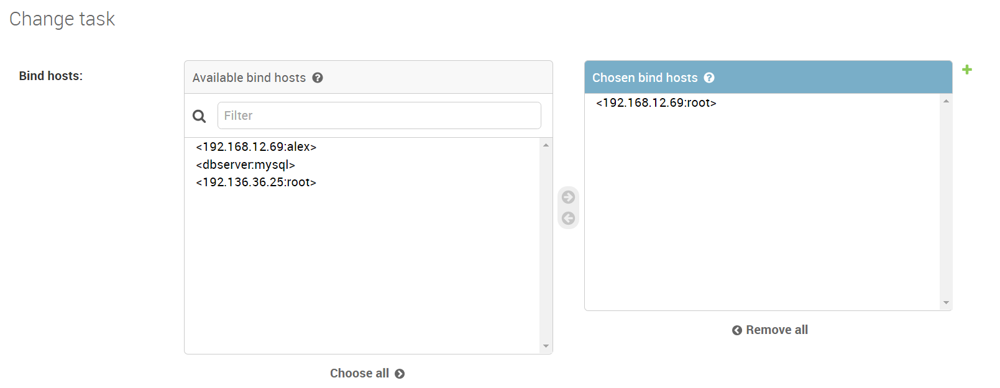
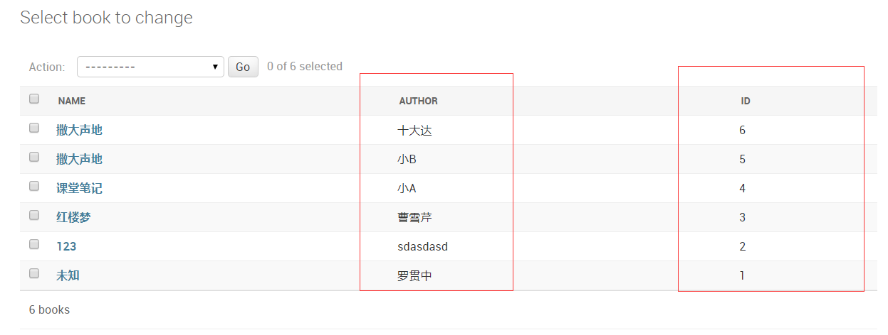

# #准备工作

> 创建用户名与密码

```
python manage.py createsuperuser
```

> 为APP注册到后台

```python
#admin.py
from django.contrib import admin
from book import models #导入ORM模型
# Register your models here.

admin.site.register(models.Book)
```

> 搜索admin文件

在`INSTALLED_APPS`设置中添加了`django.contrib.admin`后，Django将自动在每个应用中搜索admin模块并导入它。也就是说，通常我们在每个app下都有一个admin.py文件，将当前app和admin有关的内容写到内部的admin.py文件中就可以了，Django会自动搜索并应用它们

---

### #Admin自定义

```python
from django.contrib import admin
from .models import Book


# 创建一个BookAdmin的子类
class BookAdmin(admin.ModelAdmin):
    list_display = ('name',) #添加展示字段
    list_filter = ('name',) #添加过滤器列表
# 注册的时候，将原模型和BookAdmin耦合起来
admin.site.register(Book,BookAdmin)
```


#### ModelAdmin.actions_selection_counter

是否在actions下拉框右侧显示选中的对象的数量，默认为True，可改为False


#### ModelAdmin.date_hierarchy

根据指定的日期相关的字段，为页面创建一个时间导航栏，可通过日期过滤对象


#### ModelAdmin.exclude

不显示指定的某些字段

```python
#models.py
from django.db import models

class Author(models.Model):
    name = models.CharField(max_length=100)
    title = models.CharField(max_length=3)
    birth_date = models.DateField(blank=True, null=True)
		
#admin.py
from django.contrib import admin

class AuthorAdmin(admin.ModelAdmin):
#注意了，值是个元组！一个元素的时候，最后的逗号不能省略
    fields = ('name', 'title') #等同于  exclude = ('birth_date',)
		
```

#### ModelAdmin.fields

顺序，显示指定的字段。与exclude相对 

小技巧，你可以通过组合元组的方式，让某些字段在同一行内显示，例如下面的做法“url”和“title”将在一行内，而“content”则在下一行

```
class FlatPageAdmin(admin.ModelAdmin):
    fields = (('url', 'title'), 'content')
```

#### ModelAdmin.fieldsets

根据字段对页面进行分组显示或布局了。fieldsets是一个二元元组的列表。每个二元元组代表一个`<fieldset>`，是整个form的一部分

- classes一个包含额外的CSS类的元组
    - collaspe 将fieldsets折叠起来
    - wide 让它具备更宽的水平空间

```python
from django.contrib import admin
from .models import Book


# 创建一个BookAdmin的子类
class BookAdmin(admin.ModelAdmin):
    list_display = ('name',)
    list_filter = ('name',)
    # date_hierarchy = 'pub_date'
    fieldsets = (
        ('文章内容',{'fields':['author']}
         ),
        ('高级板块',{'fields':['name'],'classes':('collapse',)})
    )
# 注册的时候，将原模型和BookAdmin耦合起来
admin.site.register(Book,BookAdmin)
```


#### ModelAdmin.list_filter

设置list_filter属性后，可以激活修改列表页面的右侧边栏，用于对列表元素进行过滤

```python
# 创建一个BookAdmin的子类
class BookAdmin(admin.ModelAdmin):
    list_filter = ('name',)
```


#### ModelAdmin.search_fields

设置这个属性，可以为admin的修改列表页面添加一个搜索框.

被搜索的字段可以是CharField或者TextField文本类型，也可以通过双下划线进行ForeignKey或者ManyToManyField的查询


```
search_fields = ['name']
```

#### ModelAdmin.filter_horizontal

水平扩展多对多字段。默认情况下，ManyTOManyField在admin的页面中会显示为一个select框。在需要选择大量对象时，这会有点困难。将ManyTOManyField添加到这个属性列表里后，页面就会对字段进行扩展，并提供过滤功能
```python
filter_horizontal = ('tags',)
```



#### 

**list_per_page**

每页展示多少数据

**autocomplete_fields =['字段']**

自动补全。只能放外键

**radio_fields = {'字段',admin.VERTICAL}**

下拉框变Radio 水平排列

### #list_display

指定显示在修改页面上的字段。这是一个很常用也是最重要的技巧

```python
class BookAdmin(admin.ModelAdmin):
    list_display = ('name','author','id')
```



如果你不设置这个属性，admin站点将只显示一列，内容是每个对象的`__str__()`

在`list_display`中，你可以设置四种值

- 模型的 ~~字段名~~
- 一个 ~~函数~~，接受一个模型实例作为参数
- 一个表示ModelAdmin的某个属性的字符串
- 一个表示模型的某个属性的字符串

> 如何引用CSS样式

```python
#Models.py
from django.db import models
from django.utils.html import format_html

class Book(models.Model):、
    id = models.AutoField(primary_key=True)
    name = models.CharField(max_length=255, null=False)
    author = models.CharField(max_length=255, null=False)

    def showStr(self):
        return format_html('<span style="color:blue">Good</>')

#Admin.py
class BookAdmin(admin.ModelAdmin):
    list_display = ('name','author','id','showStr')
```


> 自定义表的名称

```python
class Book(models.Model):
    ...
    class Meta:
        verbose_name_plural='书籍'
```