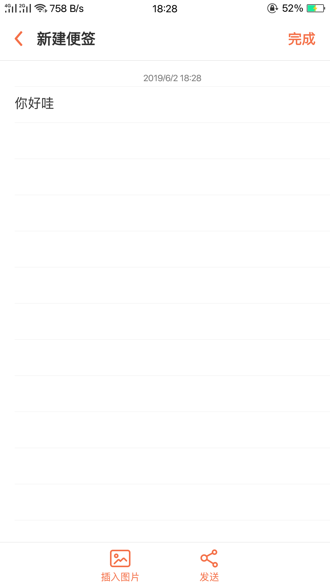
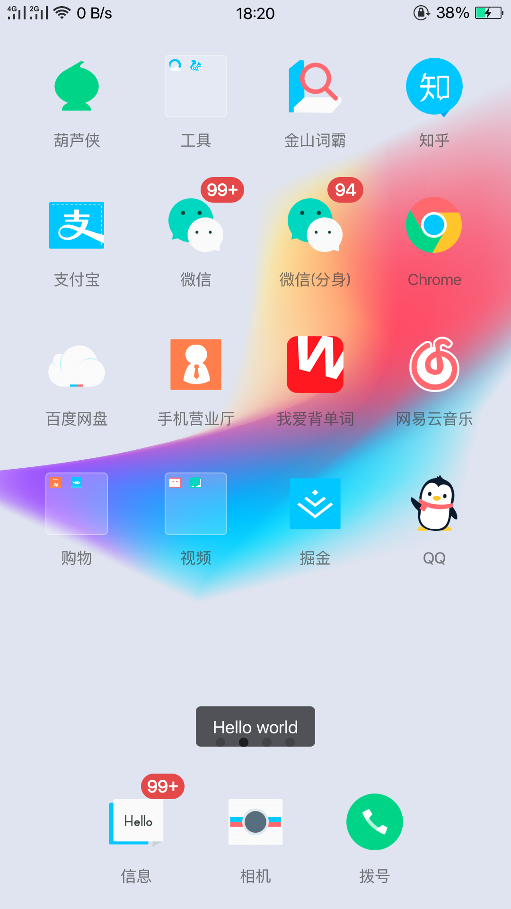

## Uiautomator2

## 准备工作

1. 配置Android-adb
2. 安装uiautomator2

```python
pip install --pre -U uiautomator2
```
3. 手机安装软件

```python
python -m uiautomator2 init
```

4. 可视化界面

```python
pip install --pre weditor

#启动
python -m weditor
```
## 连接手机

两种方式

1. USB
2. WIFI

```python
import uiautomator2 as u2


# 通过WIFI连接
d = u2.connect('192.168.1.103')
print(d.info)

# 通过USB连接
# d = u2.connect("37e7d8e9") #命令行输入adb devices查看设备序列
```


## 安装应用

```
d.app_install（'APK_URL '）
```

## 定位方式

1. ResourceId定位: 

2. Text定位
   
3. Description定位 

4. ClassName定位 

```python
d(resourceId="com.smartisanos.clock:id/text_stopwatch").click()

d(text="秒表").click()

d(description="..").click()

d(className="android.widget.TextView").click()
```

## 交互

### 点击

- 点击屏幕

d.click(x,y)

- 双击屏幕

d.double_click(x,y)

- 长按屏幕

```python
d.swipe(sx,sy,ex,ey)

d.swipe(sx, sy, ex, ey, 0.5) # swipe for 0.5s(default)
```

- 滑动点

```python
# swipe from point(x0, y0) to point(x1, y1) then to point(x2, y2)
# time will speed 0.2s bwtween two points
d.swipe((x0, y0), (x1, y1), (x2, y2), 0.2)
```

- 拖动

```python
d.drag(sx, sy, ex, ey)
d.drag(sx, sy, ex, ey, 0.5) # Drag for 0.5s(default)
```

九宫格解锁

```python
d.swipe_points([(0.235, 0.456), (0.503, 0.449), (0.509, 0.601), (0.777, 0.603), (0.771, 0.763), (0.222, 0.75)], 0.2)
```

**注意**

这些操作也可以支持百分比位置值

d.long_click(0.5, 0.5） 长按屏幕中心

## 选择

- text 文本选择
- className 
- description 描述选择
- `checkable`，`checked`，`clickable`，`longClickable`
- `scrollable`，`enabled`，`focusable`，`focused`，`selected`
- `packageName`， `packageNameMatches`
- `resourceId`， `resourceIdMatches`
- `index`， `instance`

**Selector**

打开QQ

```python
import uiautomator2 as u2


# 通过WIFI连接
d = u2.connect('192.168.1.103')
print(d.info)

# 选择文本为'QQ'的对象，其className为'android.widget.TextView'的应用
d(text='QQ', className='android.widget.TextView').click()
```

## 对选择的对象执行操作

- 执行单击

```python
d = u2.connect('192.168.1.103')
print(d.info)

# 选择文本为'QQ'的对象，其className为'android.widget.TextView'的应用
d(text='QQ', className='android.widget.TextView').click(timeout=10)
```

- 执行长按

长按QQ图标

```python
d(text='QQ', className='android.widget.TextView').long_click()
```


### 发送文字

**set_text()**

打开便签然后输入文字



```python
import uiautomator2 as u2


# 通过WIFI连接
d = u2.connect('192.168.1.103')


d(text="便签").click()
d(resourceId="com.nearme.note:id/menu_new_note").click()
d(resourceId="com.nearme.note:id/text").set_text("你好哇")
d.press('back')
```

如果定位不到元素使用send_keys()方法

```python
d.set_fastinput_ime(True)
d.send_keys("Hello")
d.set_fastinput_ime(False) # 输入法用完关掉
```

### 手势操作

- 拖动对象

```python
# notes : Android<4.3不能使用drag.
# 0.5S后，将UI对象拖动到屏幕点（x，y）
d(text="Settings").drag_to(x, y, duration=0.5)
# drag the UI object to (the center position of) another UI object, in 0.25 second
d(text="Settings").drag_to(text="Clock", duration=0.25)
```

- 两点手势操作，从一个点到另一个点

```python
d(text="Settings").gesture((sx1, sy1), (sx2, sy2), (ex1, ey1), (ex2, ey2))
```

#### 两种手势

- In
- Out

```python
# notes : pinch can not be set until Android 4.3.
# 从边缘到中心. here is "In" not "in"
d(text="Settings").pinch_in(percent=100, steps=10)
# 从中心到边缘
d(text="Settings").pinch_out()
```

- 等到特定UI出现或消失

```python
# 一直等到UI对象出现
d(text="Settings").wait(timeout=3.0) # return bool
# 一直等到UI对象消失
d(text="Settings").wait_gone(timeout=1.0)
```

## Toast

这是手机提示消息

- 手机屏幕显示Toast

```python
d.toast.show("Hello world")
d.toast.show("Hello world", 1.0) # 显示 1.0s, 默认 1.0s
```



```python
import uiautomator2 as u2


# 通过WIFI连接
d = u2.connect('192.168.1.103')
print(d.info)

#设置
d.toast.show("Hello world", 5.0)

#获取
"""
1. 最大等待时间
2. 缓冲时间
3. 
"""
d.toast.get_message(5.0, 10.0, "Hello world")

# 清除
d.toast.reset()
```

## 截图

```python

# 截取并保存到计算机上的文件，需要Android> = 4.2。
d.screenshot("home.jpg")


# 得到PIL.Image格式的图像. 但你必须先安装pillow
image = d.screenshot() # default format="pillow"
image.save("home.jpg") # or home.png. Currently, 只支持png and jpg格式的图像

# 得到OpenCV的格式图像。当然，你需要numpy和cv2安装第一个
import cv2
image = d.screenshot(format='opencv')
cv2.imwrite('home.jpg', image)


# 获取原始JPEG数据
imagebin = d.screenshot(format='raw')
open("some.jpg", "wb").write(imagebin)
```


## XPath定位

```python

# wait exists 10s
d.xpath("//android.widget.TextView").wait(10.0)
# find and click
d.xpath("//*[@content-desc='分享']").click()
# get all text-view text, attrib and center point
for elem in d.xpath("//android.widget.TextView").all():
    print("Text:", elem.text)
    # Dictionary eg: 
    # {'index': '1', 'text': '999+', 'resource-id': 'com.netease.cloudmusic:id/qb', 'package': 'com.netease.cloudmusic', 'content-desc': '', 'checkable': 'false', 'checked': 'false', 'clickable': 'false', 'enabled': 'true', 'focusable': 'false', 'focused': 'false','scrollable': 'false', 'long-clickable': 'false', 'password': 'false', 'selected': 'false', 'visible-to-user': 'true', 'bounds': '[661,1444][718,1478]'}
    print("Attrib:", elem.attrib)
    # Coordinate eg: (100, 200)
    print("Position:", elem.center())
```

## 其他

**打开通知或快速设置**

```python
d.open_notification()
```

**获取当前屏幕上文本的视图总数**

```python
d(text="Add new").count


d.info

一个UI对象信息
{
	'bounds': {
		'bottom': 2110,
		'left': 422,
		'right': 1015,
		'top': 2009
	},
	'childCount': 0,
	'className': 'android.widget.TextView',
	'contentDescription': '',
	'packageName': 'com.taobao.taobao',
	'resourceName': None,
	'text': '  python书籍python基础教程教材Python编程从零基础到项目实战实例python入门python语言及其应用程序设计python爬虫python视频教程',
	'visibleBounds': {
		'bottom': 2110,
		'left': 422,
		'right': 1015,
		'top': 2009
	},
	'checkable': False,
	'checked': False,
	'clickable': False,
	'enabled': True,
	'focusable': False,
	'focused': False,
	'longClickable': False,
	'scrollable': False,
	'selected': False
}
```

**获取|设置|清除 可编辑字段的的文本**

`clear_text()` `set_text()` `get_text()` 

```python
d(resourceId="com.taobao.taobao:id/searchEdit").clear_text()
d.toast.show("正在搜索")
d(resourceId="com.taobao.taobao:id/searchEdit").set_text("Java")
time.sleep(3)
pr = d(resourceId="com.taobao.taobao:id/searchEdit").get_text()
print(pr)
```


## 参考资料

[https://blog.csdn.net/ricky_yangrui/article/details/81415365](https://blog.csdn.net/ricky_yangrui/article/details/81415365)

