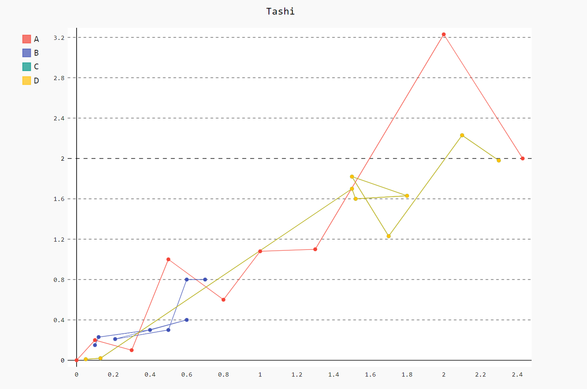
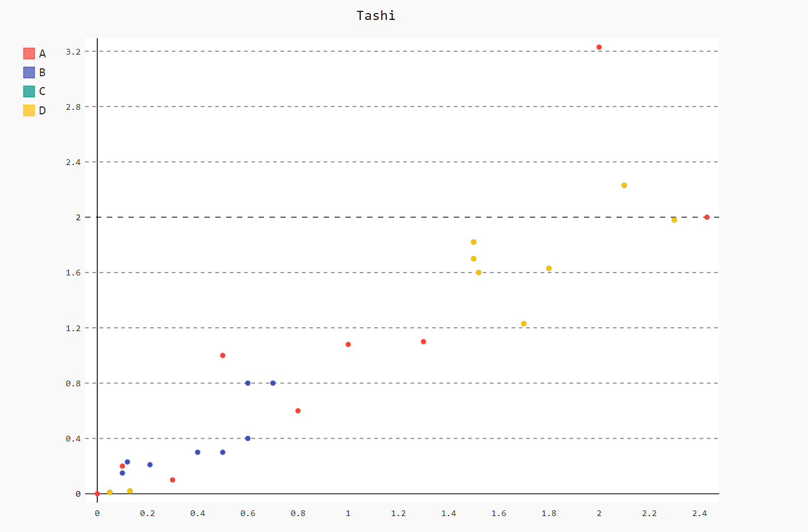
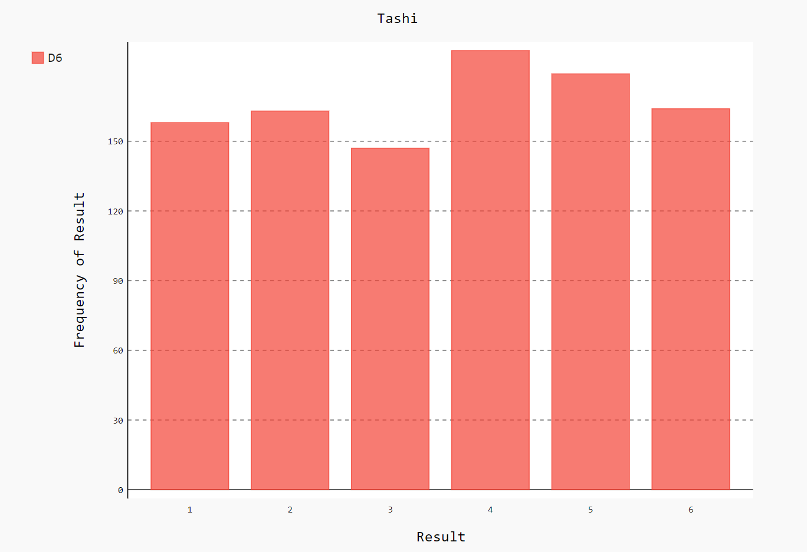
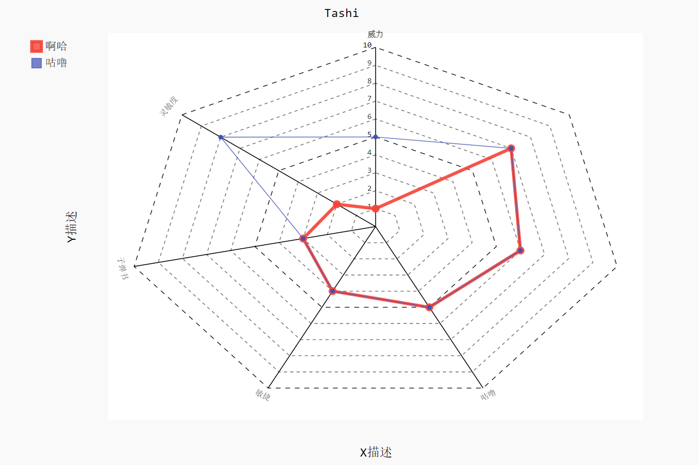

# Pygal

> 安装

```python
pip install pygal
```

## 步骤

1. 创建pygal对象。pygal为不同的数据图提供了不同的类
   1. 柱状图pygal.Bar
   2. 饼图pygal.Pie
   3. 折线图pygal.Line
2. 调用add()方法添加数据
3. 调用Config对象配置数据图
4. render_to_xxx()将数据渲染出来


### 折线图

```python
import pygal

radar_chart = pygal.XY() #设置散点图
radar_chart.title = 'Tashi' #设置图标标题
"""
参数1
    - 添加的种类
参数2
    - 坐标(x,y)用列表包起来
"""

radar_chart.add('A', [(0, 0), (.1, .2), (.3, .1), (.5, 1), (.8, .6), (1, 1.08), (1.3, 1.1), (2, 3.23), (2.43, 2)])
radar_chart.add('B', [(.1, .15), (.12, .23), (.4, .3), (.6, .4), (.21, .21), (.5, .3), (.6, .8), (.7, .8)])
radar_chart.add('C', [(.05, .01), (.13, .02), (1.5, 1.7), (1.52, 1.6), (1.8, 1.63), (1.5, 1.82), (1.7, 1.23), (2.1, 2.23), (2.3, 1.98)])
radar_chart.add('D', [(.05, .01), (.13, .02), (1.5, 1.7), (1.52, 1.6), (1.8, 1.63), (1.5, 1.82), (1.7, 1.23), (2.1, 2.23), (2.3, 1.98)])

#保存
radar_chart.render_to_file('die_visual.svg')
```



- pygal.XY(stroke=False)即可设置散点图，图线不连


### 散点图

```python
import pygal

radar_chart = pygal.XY(stroke=False) #设置散点图
radar_chart.title = 'Tashi' #设置图标标题

"""
参数1
    - 添加的种类
参数2
    - 坐标(x,y)用列表包起来
"""
radar_chart.add('A', [(0, 0), (.1, .2), (.3, .1), (.5, 1), (.8, .6), (1, 1.08), (1.3, 1.1), (2, 3.23), (2.43, 2)])
radar_chart.add('B', [(.1, .15), (.12, .23), (.4, .3), (.6, .4), (.21, .21), (.5, .3), (.6, .8), (.7, .8)])
radar_chart.add('C', [(.05, .01), (.13, .02), (1.5, 1.7), (1.52, 1.6), (1.8, 1.63), (1.5, 1.82), (1.7, 1.23), (2.1, 2.23), (2.3, 1.98)])
radar_chart.add('D', [(.05, .01), (.13, .02), (1.5, 1.7), (1.52, 1.6), (1.8, 1.63), (1.5, 1.82), (1.7, 1.23), (2.1, 2.23), (2.3, 1.98)])

#保存
radar_chart.render_to_file('die_visual.svg')
```


### 配置


通过 对象来配置

```python
bar.x_label_roration=30 #X轴刻度旋转45deg
bar.legend_at_bottom=True #图例放在底部
bar.margin = 15
bar.show_y_guides = False #隐藏X轴网格线
bar.show_x_guides = True #显示Y轴网格线
```


### 柱状图

```python
import pygal


# 条形图
hist = pygal.Bar()
hist.title = 'Tashi' #设置标题
hist.x_labels = [1, 2, 3, 4, 5, 6] #X坐标
hist.y_labels = [0, 30, 60, 90, 120, 150] #Y坐标
hist.x_title = 'Result' #X描述
hist.y_title = 'Frequency of Result' #Y描述

# 设置数据
data = [158, 163, 147, 189, 179, 164]
hist.add('D6', data) #添加

#保存数据
hist.render_to_file('bar_chart.svg')
```




```python
import pygal

# 条形图
bar = pygal.HorizontalBar()
bar.x_labels = [1, 2, 3, 4, 5, 6] #X坐标
bar.y_labels = [0, 30, 60, 90, 120, 150] #Y坐标
bar.x_title = 'Result' #X描述
bar.y_title = 'Frequency of Result' #Y描述

#Data
data1 = [158, 163, 147, 189, 179, 164]
data2 = [50, 16, 47, 89, 79, 64]
bar.add('D6', data1) #添加
bar.add('D7', data2)

#配置
bar.title = 'Tashi' #设置标题
bar.legend_at_bottom=True #图例放在底部
bar.margin = 15


bar.render_to_file('die_visual.svg')
```


**分类**

1. 水平柱状图 HorizontalBar()
2. 水平折线图 HorizontalLine()
3. 水平叠加柱状图 HorizontalStackedBar()
4. 水平叠加折线图 HorizontalStackedLine()


### 雷达图

```python
import pygal

hist = pygal.Radar()

hist.title = 'Tashi' #设置标题

#设置X,Y阈值
hist.x_labels = ['威力','灵敏度','子弹书','敏捷','咕噜']
hist.y_labels = [1,2,3,4,5,6,7,8,9,10]

#X、Y描述
hist.x_title = 'X描述'
hist.y_title = 'Y描述'

#添加数据
hist.add('啊哈',[1,2,3,4,5,6,7])
hist.add('咕噜',[5,8,3,4,5,6,7])

hist.render_to_file('bar_chart.svg')
```



### 饼图 Pie

```python
import pygal

#创建对象
pie = pygal.Pie()

#对象属性
#1. inner_radius
#2. half_pie

data = [0.16,0.14,0.07,0.68]

labels = ["Java",'Python','Html','Css']

#循环赋值
for i,per in enumerate(data):
    pie.add(labels[i], per)

#配置
pie.title="饼图Show"
pie.legend_at_bottom = True
pie.inner_radius = 0.4
pie.half_pie = False

#保存
pie.render_to_file('die_visual.svg')

```


如果将pie.half_pie = False -> True


### 点图Dot

点图用点的大小表示数值的大小

```python
import pygal

#创建对象
dot = pygal.Dot()

x_label = [2015,2016,2017,2018,2019,2020]
data1 = [3000,5000,2000,8000,15000]

#添加数据
dot.add("Book",data1)


#配置
dot.title = "点图"
dot.x_labels = x_label
dot.y_labels = "Y info"
dot.y_label_rotation = 45
dot.x_title = "年份"
dot.legend_at_bottom = True


#保存
dot.render_to_file('die_visual.svg')
```


### 阅览

- render_to_file() 保存SVG文件

- render_in_browser() 浏览器在线阅览


### 声明对象

- hist = pygal.Bar(style=**,x_label_rotation=角度，show_legend=False/True)
	- style为样式
	- x_label_rotation旋转角度（顺时针旋转）
		- 显示的是X描述的旋转角度
	- show_legend是否显示图例

### 配置

- title_font_size=66 设置标题字体大小

- label_font_size=14 副标题字体大小

- major_label_font_size=18 主标签字体大小

- show_y_guides=False 是否展示图标中水平线

- width=1000  自定义图表宽度
