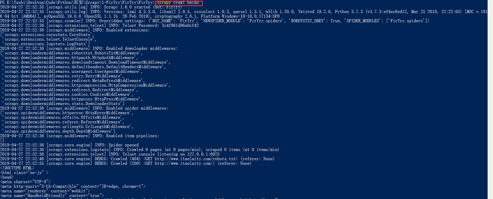
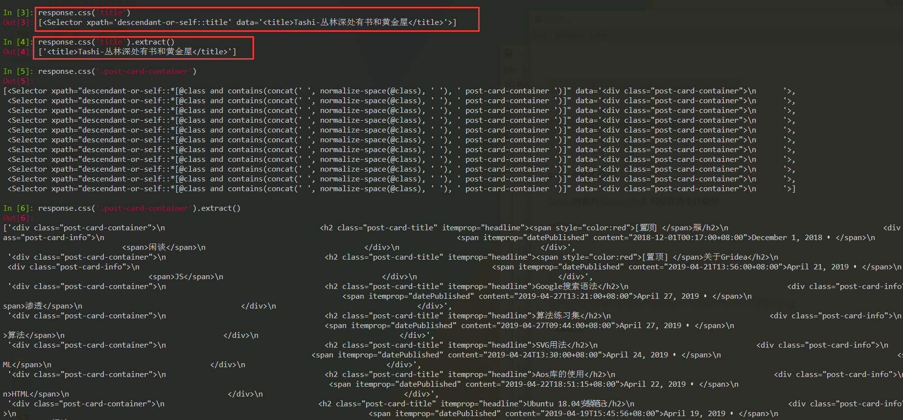

## Scrapy框架

### 核心功能

**引擎**`Scrapy Engine`

**爬虫**`Spider`

**调度器**`Scheduler`

**下载器**`Downloader`

**管道**`Item Pipeline`

**下载中间件**`Downloader Middlewares`

**Spider中间件**`Spider Middlewares`

## 实践

**安装**

```
pip install --upgrade pip 

pip install Scrapy

pip install pywin32
```

**Linux安装**

需要下载[http://twistedmatrix.com/trac/wiki/Downloads](http://twistedmatrix.com/trac/wiki/Downloads)

将源码解压到服务器

```shell
cd Twisted-19.2.1
python setup.py install 

pip3 install Scrapy
```

**爬取步骤**

1. 新建项目
2. 明确目标
3. 制作爬虫
4. 存储内容

> 新建项目

```bash
scrapy startproject FTry
```


观察创建下的项目


- `scrapy.cfg` 项目配置文件

- `items.py` 项目的目标文件

  Item是保存爬取到的数据的容器

- `pipelines.py` 项目的管道文件

- `settings.py` 项目设置文件

- `spiders` 存储爬虫代码目录

> 明确目标

创建一个`Spider`

```
scrapy genspider baidu www.baidu.com
```


必须继承`scrapy.Spider`类

- `name` 用于区别spider。该名字是唯一的。
- `start_urls` 包含了Spider在启动时进行爬取的url列表。
- `parse()` 是spider的一个方法。调用时，每个初始URL完成下载后生成的response对象将会作为唯一的参数传递给该函数。

> 制作爬虫

```
scrapy crawl your_app_name
```



#### 选择器简介

从网页中提取数据。Scrapy使用了一种基于Xpath与CSS表达式机制。

**基本方法**

- xpath()
- css() 传入css表达式
- extract() 序列化该结点并返回list
- re() 根据传入的正则表达式对数据进行提取，返回unicode字符串list列表

#### 保存数据

`-o 文件.格式`

- json 标准json格式
- jl 一行一行的格式
- csv 
- xml
- ftp 远程文件上传

```
scrapy crawl your_app_name -o   target_name.json


scrapy crawl your_app_name -o ftp://......
```

## Shell 操作

Scrapy内置的 Scrapy shell  可以在命令行操作

**开始**

```
scrapy shell "http://www.itaolaity.com"
```


**css选择**

```
response.css('__选择规则___')
```

返回一个selector的集合。如果想要提取文本可以：`extract()`



需要注意的是如果我们添加`::text`到css查询 那我们可以直接取出html代码里的文本否则取出的是完整的标签文本

如果只想要第一个结果`extract_first()`

### Response

```
In [16]: type(response)
Out[16]: scrapy.http.response.html.HtmlResponse
```

- `response.body`将会获取请求内容
- `response.headers`获取请求体

#### 选择器

- `response.selector.xpath()`
- `response.selector.css()`

```shell
In [28]: response.xpath("//title")
Out[28]: [<Selector xpath='//title' data='<title>linis-丛林深处有书和黄金屋</title>'>]

In [29]: response.css("title")
Out[29]: [<Selector xpath='descendant-or-self::title' data='<title>linis-丛林深处有书和黄金屋</title>'>]
```

## 应用

**目标爬取导航网站**

就拿我自己的网站来爬取吧。获取网站的标题、时间、种类


首先对获取的数据进行建模

```python
# items.py
import scrapy


class FtryItem(scrapy.Item):
    title = scrapy.Field()
    time = scrapy.Field()
    type = scrapy.Field()
    pass
```

```python
#itao.py
import scrapy
from ..items import *


class ItaoSpider(scrapy.Spider):
    name = 'itao'
    allowed_domains = ['www.itaolaity.com']
    start_urls = ['http://www.itaolaity.com/']

    def parse(self, response):
        post_item = response.css('.post-card-container')

        for item in post_item:
            title = item.css('.post-card-title::text').extract_first(),
            time = item.css('.post-card-info span:nth-child(1)::text').extract_first(),
            type = item.css('.post-card-info span:nth-child(2)::text').extract_first(),

            oIt = FtryItem()
            oIt['title'] = title
            oIt['time'] = time
            oIt['type'] = type
            yield  oIt
```


保存json格式文件

```bash
scrapy crawl itao -o main.json
```


