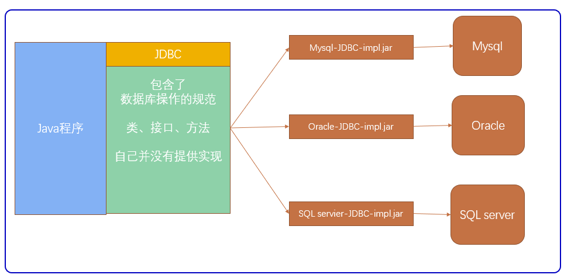
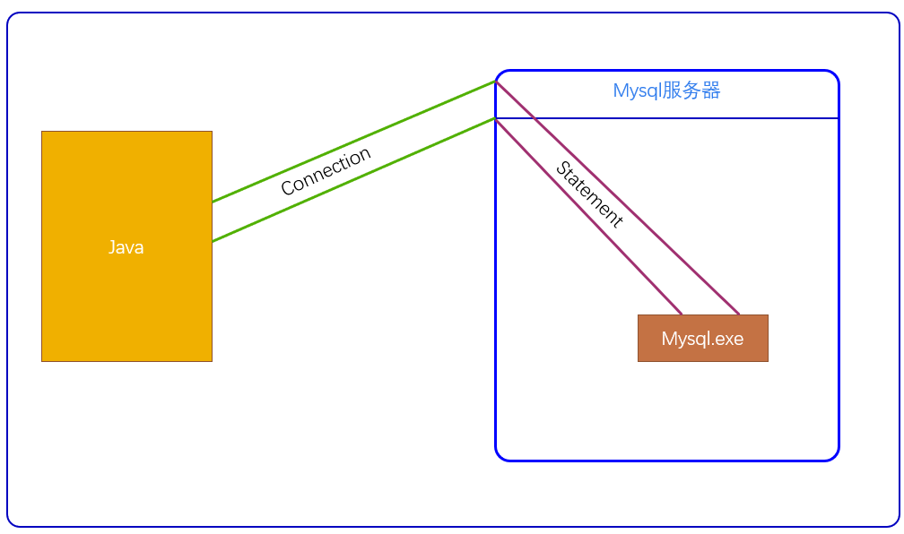
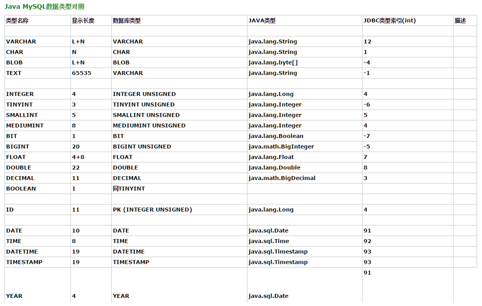

<style type="text/css">
    h1 {

        font-weight: 400;
    }
    img {
        border-radius: 10px;
        box-shadow: 0 2px 8px rgba(0,0,0,.3);
    }
    body {
        background-color: #FDF6E3;
/*      margin:0;
        outline:none;
        border:none;
        max-width: 100%;*/

    }
    import::before{
        display: inline-block;
        content: "";
        width: 10px;
        height: 10px;
        background-color: red;
        margin-right: 10px;
        border-radius: 50%;
    }
    import {
        font-size:14px;
        font-weight: bold;
        padding:0.55rem;
        border-radius:5px; 
        color:#eb5055;
    }
    .markdown-body blockquote{
        border-left: 4px solid tomato;
    }
</style>
# JDBC

### 什么是JDBC

是一种用于执行SQL语句的Java API

它是由一组用Java语言编写的类和接口组成

JDBC提供了一种操作数据的标准

JDBC的目标是使Java程序员使用JDBC可以连接任何提供了JDBC驱动程序的数据库系统


**通过驱动连接**



> ### 连接数据库

1. 添加驱动
    - 在项目目录下创建一个文件夹lib
    - 把MySQL驱动包复制到该文件夹下
    - builder path编译路径
2. 获取连接对象
    - 地址
    - 用户名
    - 密码

```java
import java.sql.Connection;
import java.sql.DriverManager;

public class Main{
    public static void main(String[] args){
        //1.加载驱动
        Class.forName("com.mysql.jdbc.Driver");

        //2.获取连接对象
        String url = "jdbc:mysql://localhost:3306/student?serverTimezone=UTC";//选择地址
        String user = "root";//用户名
        String password = ""; //密码

        Connection conn = DriverManager.getConnection(url,user,password);
        System.out.println(conn);
    }
}

"com.mysql.jdbc.JDBC4Connection@68ceda24"
```


> ### 创建表

1. 加载驱动
2. 连接数据库
3. 创建要执行的SQL语句
4. 执行SQL
5. 释放数据资源

**连接数据库**


```java
    public static void main(String[] args)throws Exception{
        //1. 加载驱动
        Class.forName("com.mysql.jdbc.Driver");

        //2. 获取连接对象
        String url = "jdbc:mysql://localhost:3306/java_test";
        String user = "root";
        String password = "";
        Connection conn = DriverManager.getConnection(url,user,password); //第一次连接

        //3. 编写SQL语句
        String sql = "create table students(id int, name varchar(255), age int)";
        Statement st = conn.createStatement(); //第二次连接

        //4. 执行SQL
        int row = st.executeUpdate(sql); //返回成功的条数
        //5. 释放资源
        st.close();
        conn.close();
    }

```
**！为什么要释放资源**

1. Connection连接就相当于Java和到Mysql之间建立管道
2. 连接只连接到数据，Statement 就相当于从数据库又接了一个管道连接Mysql的执行程序
3. 释放资源等同把管道给撤了


> ### 插入一条记录

```java
public static void main(String[] args)throws Exception{
       //1. 添加驱动
       Class.forName("com.mysql.jdbc.Driver");

       //2. 获取连接对象
       String url = "jdbc:mysql://localhost:3306/java_test";
       String user = "root";
       String password = "";
       Connection conn = DriverManager.getConnection(url,user,password);

       //3. 编写SQL语句
       String sql = "insert into students values(1,'zs',20)"; //sql语句
       Statement st = conn.createStatement();

       //4. 连接
       int row = st.executeUpdate(sql);
       System.out.println(row);
       //5. 释放
       st.close();
       conn.close();
   }
```
带有异常处理
```java
public static void main(String[] args){
        String url = "jdbc:mysql://localhost:3306/java_test";
        String user = "root";
        String password = "";
        Connection conn = null;
        Statement st = null;
        try{
            //1. 添加驱动
            Class.forName("com.mysql.jdbc.Driver");
            //2. 连接数据库
            conn = DriverManager.getConnection(url,user,password);
            //3. 编写SQL语句
            String sql = "insert into students values(3,'aha',20)"; //sql语句
            st = conn.createStatement();

            //4. 连接
            int row = st.executeUpdate(sql);
            System.out.println(row);
        }catch(Exception e){
            e.printStackTrace();
        }finally{
            //5. 释放资源
            if(st != null){
                try{
                    st.close();
                }catch(Exception e){
                    e.printStackTrace();
                }
            }
            if(conn != null){
                try{
                    conn.close();
                }catch(Exception e){
                    e.printStackTrace();
                }
            }
        }

    }
```


> ### 查询操作

**结果集**

- ResultSet    表示数据库查询的结果的集合,在执行查询语句时就会得到一个这样的结果

**常用方法**

-   `boolean  next()`:判断是否有下一行数据,若有,则向下移动一行指针

- 	`getXxx(int columnIndex)`:获取当前行中,第几列.(从1开始):不推荐

- 	getXxx(String columnName):获取当前行中的,指定列名的列的值.columnName是列名/列的别名

- 	若列的类型是VARCHAR/CHAR/TEXT,都使用getString来获取列的值.

- 	若列的类型是int/integer/-->getInt来获取列的值.

查询一行记录

```java
public static void main(String[] args)throws Exception{
        //1.加载驱动
        Class.forName("com.mysql.jdbc.Driver");

        //2. 获取连接对象
        String url = "jdbc:mysql://localhost:3306/java_test";
        String user = "root";
        String password = "";
        Connection conn = DriverManager.getConnection(url,user,password);

        //3.编写SQL
        String sql = "select * from students";
        Statement st = conn.createStatement();

        //4.执行SQL
        ResultSet res = st.executeQuery(sql);

        if(res.next()){
            int id = res.getInt("id");
            String ename = res.getString("name");
            int age = res.getInt("age");

          System.out.println(id+ename+age);


        }

        //5.释放资源
        st.close();
        conn.close();
    }
```

获取多行数据
```java
//4.执行SQL
ResultSet res = st.executeQuery(sql);

while(res.next()){
    int id = res.getInt("id");
    String ename = res.getString("name");
    int age = res.getInt("age");

    System.out.println(id+ename+age);
}
```

注意要查询的记录与Java的数据类型一定要一一对应

**Mysql与Java数据类型对照表**



